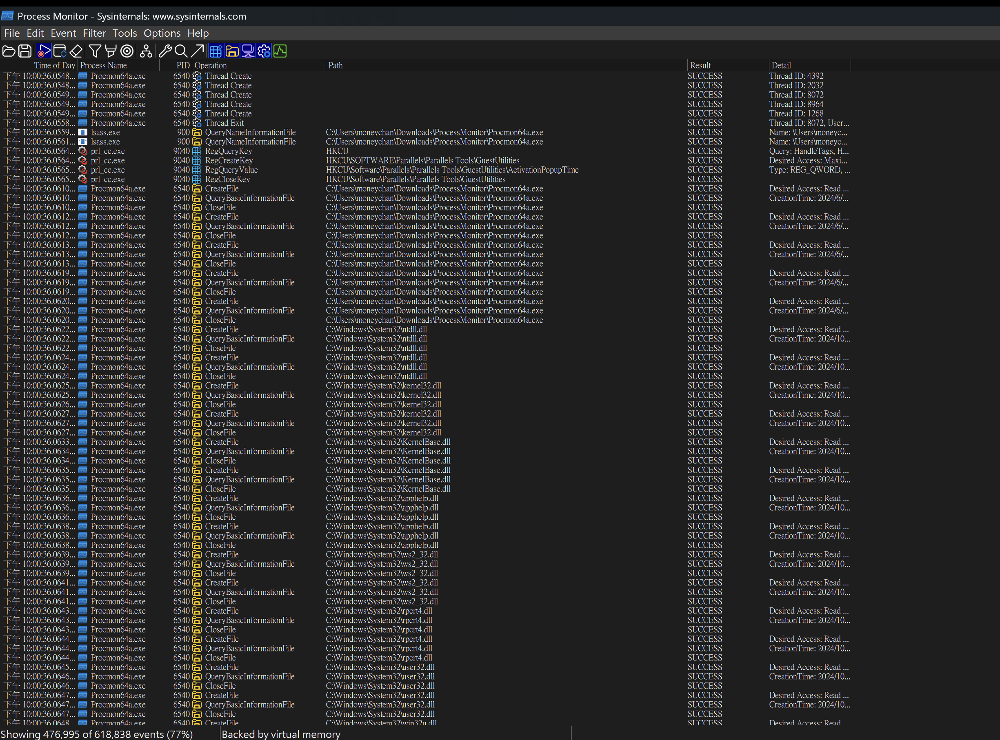
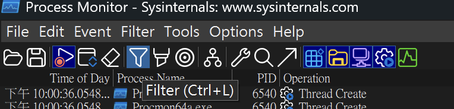
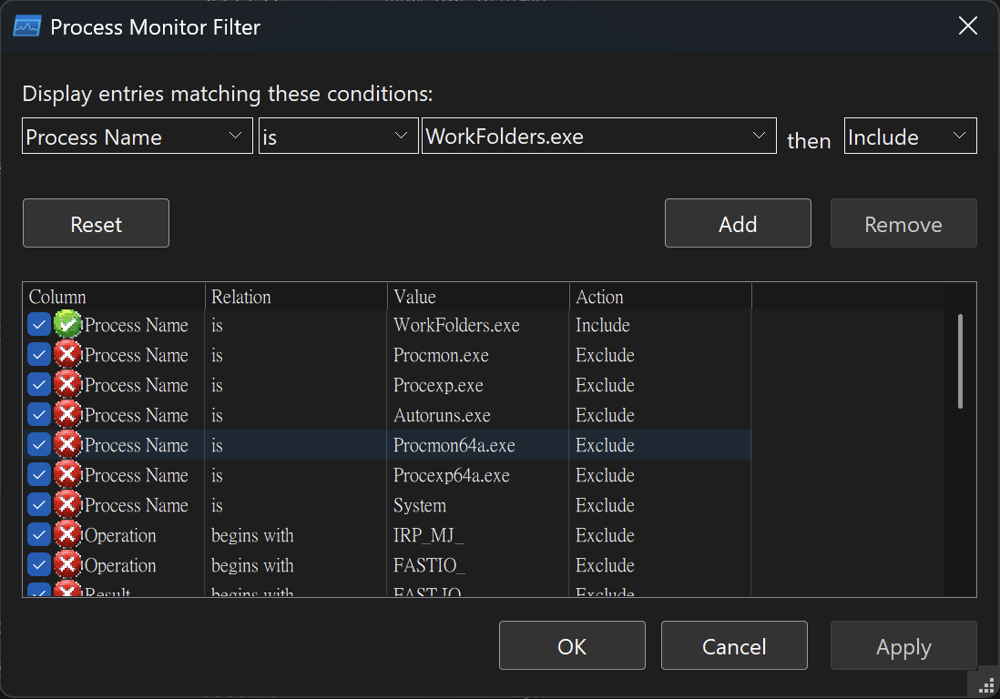
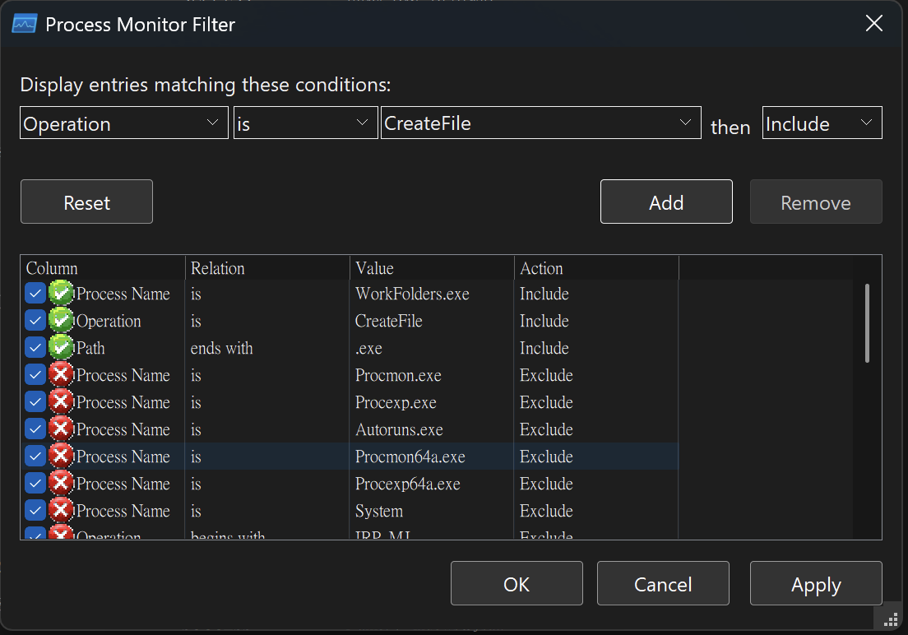
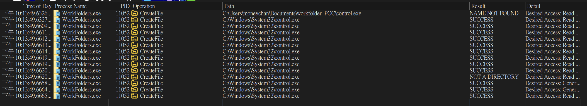
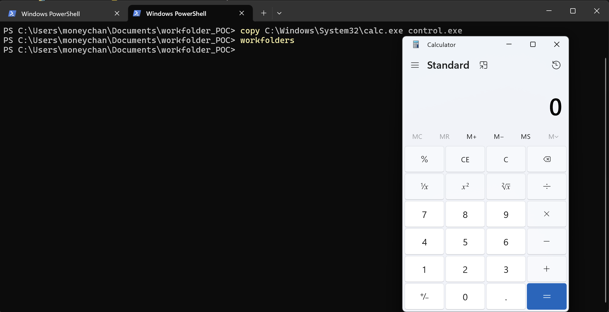
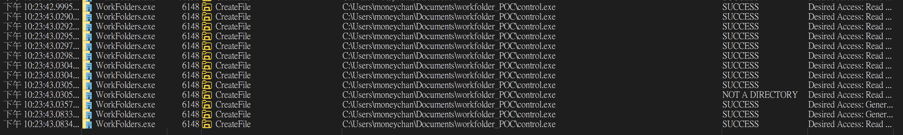

WorkFolders.exe 是 Windows 內建的工作資料夾這個功能的主程式，  
一般使用上的功能是可以讓使用者在公司的伺服器個人電腦或裝置之間同步資料，  
類似雲端硬碟，但主要是針對企業環境

## 攻擊 Demo

* * *

這篇文章的攻擊手法參考自 Elliot 的文章  
[https://x.com/ElliotKillick/status/1449812843772227588](https://x.com/ElliotKillick/status/1449812843772227588)  
文章中提到透過在當下的資料夾放一個假的 control.exe，便可以透過 Workfolder.exe 打開，

但文章中好像沒有提到怎麼發現的，  
所以我有自己去透過 procmon 去抓到問題點，  
那就準備一起來看看吧！

### Step 1：打開 procmon 看一下

這個是許多人在研究 LOLBAS 專案下會用到的工具，  
主要可以看一個程式在執行的過程中，  
會呼叫哪些東西創建哪些檔案打開哪些內容......  
常常我們就可以做到中間的劫持來達成攻擊的目的

這邊提供下載的網址：  
[https://learn.microsoft.com/zh-tw/sysinternals/downloads/procmon](https://learn.microsoft.com/zh-tw/sysinternals/downloads/procmon)

打開後應該就會看到 一大串東西直接顯示出來XD  


可是我們不用那麼多東西，  
所以有個很重要的功能 -- Filter，  
就可以在這時候派上用場，



沒錯就是這個長得像漏斗的東西，  
打開後應該就可以進到篩選的設定，  


在這邊，我們就可以去挑自己要的 Architecture, Process Name, Path，  
來找到我們要專注的目標，  
那一開始我們就先鎖定在 Workfolders.exe 上面！

  
(記得要按 Add, Apply)

一開始如果完全空白是正常的，  
當我們在終端機執行 WorkFolders.exe 後，  
所有執行過程的詳細資訊就會列出來了！

### Step 2: 執行 WorkFolders.exe

我們在終端機上打：

```bash
Workfolders

```

這時候應該會看到一個工作資料夾視窗跳出來，  


然後 procmon 應該也會把執行的細節全部列出來了  


這時候我們應該會發現，  
東西還是太多了，  
所以我們要繼續用 filter 來做進一步的篩選！

### Step 3：繼續和 procmon 奮戰



平常如果自己要看大概就是要花一大段時間從頭到尾掃完全部細節，  
再一個一個慢慢試，  
但這邊也給一些小小的經驗，

Path: 通常漏洞點很多都發生在執行檔上，所以使用 .exe  
Operation: 跟 File 相關的通常都可以先看看  
所以上面的設定才會是這個樣子

接下來應該就會只剩這些了  
  
其實重點就在第一行那邊！  
我們會發現他在當下的目錄找了一個 control.exe  
而且後面顯示 NAME NOT FOUND，  
最後才去創建一個新的，叫出工作資料夾

### Step 4：相對路徑劫持！

所以如果我們在當下的資料夾放一個 calc.exe，  
再改名叫做 control.exe 會發生什麼事？  
  
小算盤就被叫出來了！

也附上這個時候的 procmon 資料：  


## 總結！

* * *

這次文章希望除了帶給大家攻擊手法外，  
也可以讓大家看看發覺漏洞的一些簡易過程，  
希望能夠看到大家挖出更多漏洞！