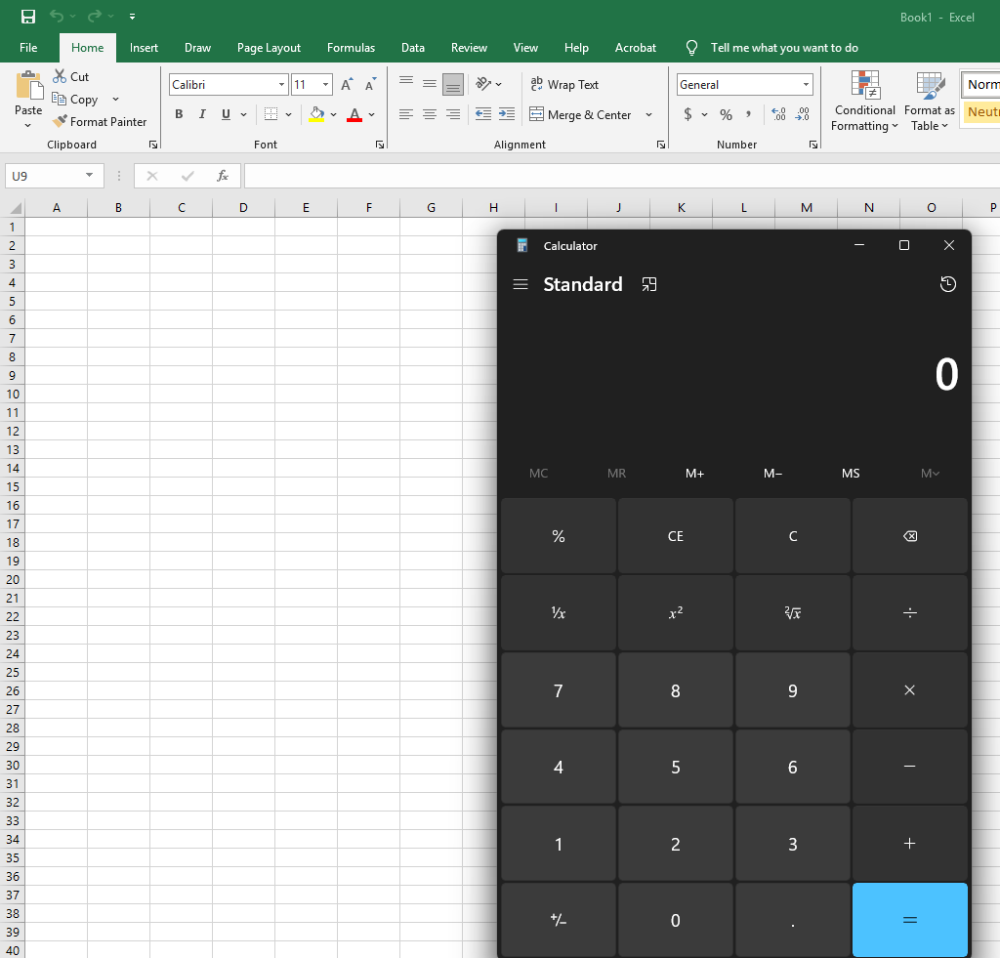
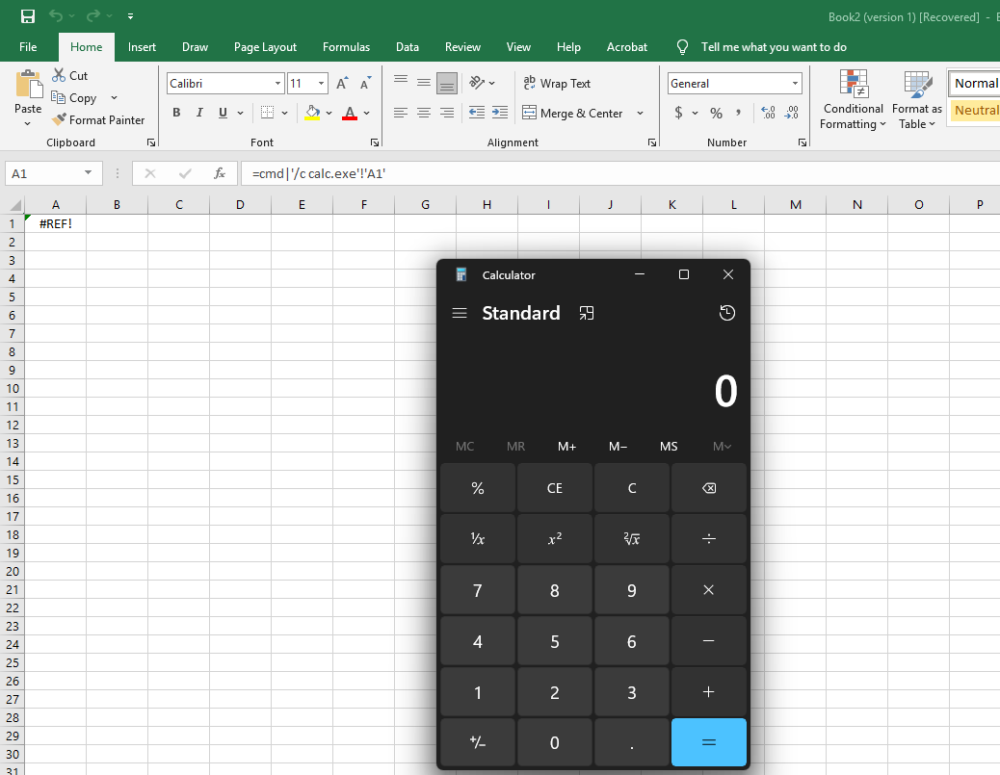

Excel.exe不只是試算表軟體，  
內建的**VBA巨集**和**DDE功能**也讓他成為完美的惡意程式執行平台，  
幾乎存在於每台商用電腦中

## 工具特性

* * *

*   **路徑**: `C:\Program Files\Microsoft Office\root\Office16\EXCEL.EXE`
*   **濫用點**: VBA巨集DDE公式
*   **優勢**: 使用者信任繞過白名單

## 攻擊Demo

* * *

### 第一種：VBA Macros

最經典的攻擊方式  
攻擊者會撰寫一段惡意的 VBA 程式碼，並將其嵌入到 Excel 檔案的巨集中  
為了讓程式碼自動執行，通常會利用內建的事件觸發器，  
例如 Auto\_Open() 或 Workbook\_Open()，  
只要使用者一打開檔案並啟用內容，惡意程式碼就會立刻執行

#### Step 1：建立惡意 VBA 程式碼

*   打開一個新的 Excel 檔案
*   按下 Alt + F11 進入 VBA 編輯器
*   在左側的專案總管中，找到 ThisWorkbook 並雙擊它
*   在右側的程式碼視窗中，貼上以下程式碼：

```
Private Sub Workbook_Open()
    Shell "C:\Windows\System32\calc.exe", vbNormalFocus
End Sub

```

#### Step 2：儲存檔案並進行社交工程

*   關閉 VBA 編輯器
*   將檔案另存為Excel 啟用巨集的活頁簿 (\*.xlsm)
*   當受害者打開這個檔案時，Excel 會顯示一條黃色的安全性警告：保護檢視...啟用內容
*   攻擊者通常會在文件內容中加入誘騙性文字，例如請點擊啟用內容以檢視完整報表或文件已使用新版加密，需啟用巨集才能解密
*   一旦使用者點擊啟用內容，Workbook\_Open() 就會被觸發，小算盤隨即彈出在真實攻擊中，calc.exe 會被換成 powershell.exe -enc ... 來下載並執行真正的惡意軟體



### 第二種：DDE (動態資料交換) - 復古的攻擊手法

DDE 是一個較老的 Windows 技術，允許應用程式之間交換資料  
雖然微軟已經預設停用並加入更多警告，但它仍然可能在某些舊版或設定不當的環境中被利用  
攻擊者可以在儲存格中插入一個特製的 DDE 公式，  
當使用者打開檔案時，這個公式會嘗試啟動 cmd.exe 或 powershell.exe

#### Step 1：使用 DDE 執行命令

在任意儲存格中，輸入以下公式：

```
=cmd|'/c calc.exe'!A1

```

儲存並重新打開檔案

Excel 會跳出多個安全性警告，詢問是否要啟動外部程式如果使用者一路點擊是，小算盤就會被執行



## 偵測方法

* * *

```powershell
# 監控Excel產生的子進程（關鍵指標）
Get-WmiObject Win32_Process | Where {
    $_.ParentProcessId -in (Get-Process EXCEL -EA 0).Id
} | Select Name, CommandLine

# 掃描可疑Excel檔案
Get-ChildItem "$env:TEMP\*.xls*" -EA 0 | ForEach {
    $content = Get-Content $_.FullName -EA 0 | Out-String
    if($content -match "=cmd\||Shell |Workbook_Open"){
        echo "[!] Malicious: $($_.Name)"
    }
}

```

## 防禦措施

* * *

```powershell
# 完全停用VBA巨集
reg add "HKCU\Software\Microsoft\Office\16.0\Excel\Security" /v VBAWarnings /t REG_DWORD /d 4 /f

# 停用DDE
reg add "HKCU\Software\Microsoft\Office\16.0\Excel\Security" /v DisableDDEServerLaunch /t REG_DWORD /d 1 /f
reg add "HKCU\Software\Microsoft\Office\16.0\Excel\Security" /v DisableDDEServerLookup /t REG_DWORD /d 1 /f

```

## IOCs

* * *

*   Excel.exe calc.exe/cmd.exe/powershell.exe
*   .xlsm/.xlsb檔案（含巨集）
*   CSV含有`=cmd|`開頭的內容
*   Excel產生非預期的子進程

## 總結

* * *

Excel透過VBA巨集和DDE提供強大的程式執行能力配合社交工程（偽裝成報表發票），成功率極高

**最簡VBA攻擊**：

```vb
Private Sub Workbook_Open(): Shell "calc": End Sub

```

**最簡DDE攻擊**：

```
=cmd|'/c calc'!A1

```