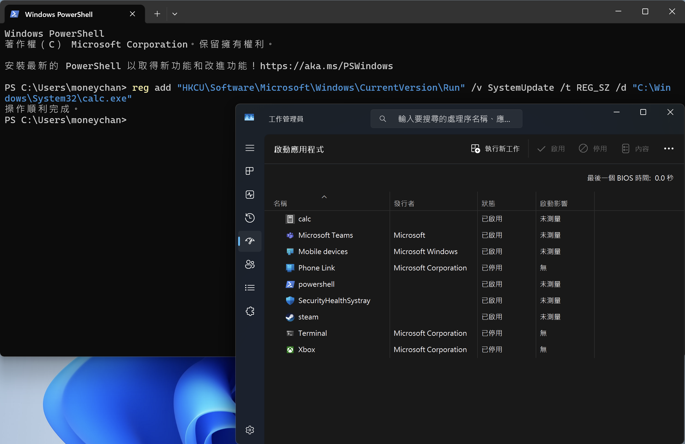

Explorer.exe是Windows的桌面外殼，控制所有GUI介面  
透過**自動啟動註冊表**，可實現完美的持久化，  
每次登入自動執行惡意程式

## 工具特性

* * *

*   **路徑**: `C:\Windows\explorer.exe`
*   **濫用點**: 自動載入Run註冊表項目
*   **優勢**: 無需管理員權限絕對信任

## 註冊表機碼（AutoRun Keys）

* * *

`explorer.exe` 的一個核心任務，就是要在使用者登入後，  
準備好整個工作環境，  
過程裡就會需要去檢查一系列特殊的登錄碼（Registry）位置  
然後再執行裡面定義好的所有程式

最常見會被濫用的 AutoRun Keys 位置是在：  
`HKEY_CURRENT_USER\Software\Microsoft\Windows\CurrentVersion\Run`  
那我們拆開來看一下：

*   `HKEY_CURRENT_USER`(HKCU)：存**當前登入使用者**的設定
*   修改這個路徑的 Registry，完全不用管理員權限，普通權限的 malware 就可以在這邊登記，下次跟著 explorer.exe 一起啟動

## 攻擊Demo

* * *

我們來看看要怎麼樣在不觸發 UAC 的情況下，  
把一個程式在開機的時候自動打開

### Step 1：用 `reg add` 修改 Registry

在 powershell 中輸入：

```
reg add "HKCU\Software\Microsoft\Windows\CurrentVersion\Run" /v SystemUpdate /t REG_SZ /d "C:\Windows\System32\calc.exe"

```

一樣也拆開來看一下：

*   `reg add`：新增一個登錄碼項目
*   `HKCU\Software\Microsoft\Windows\CurrentVersion\Run`：目標路徑
*   `/v SystemUpdate`：要新增的鍵值名稱，通常會取一個看起來無害的名字
*   `/t REG_SZ`：鍵值的類型為字串
*   `/d "C:\Windows\System32\calc.exe"`：要執行的程式路徑，也就是我們的 payload

### Step 2：觸發攻擊

其實在第一步執行完後，  
我們就可以打開工作管理員，看 Startups 那邊的分頁看看，  
應該就會看到有一個會自動啟動的 calc.exe 出現了



只要電腦登出再重新登入，小算盤就會自己被打開了

順帶一提，  
照片中會看到啟動名稱是 calc，不是 SystemUpdate，

是因為在 Windows 8 之後，  
Startups 分頁就會去讀 Registry 的執行路徑，  
然後去分析檔案 Metadata，再把他的資料列出來，

所以偽裝除了檔名之外，  
也要需要去模仿正常程式呼叫才比較容易 bypass

### p.s. 記得把它清掉，不然每次開機都會跳

附上清理的指令：

```
reg delete "HKCU\Software\Microsoft\Windows\CurrentVersion\Run" /v SystemUpdate /f

```

## 偵測方法

* * *

```powershell
# 快速掃描可疑啟動項
Get-ItemProperty "HKCU:\Software\Microsoft\Windows\CurrentVersion\Run" | ForEach {
    $_.PSObject.Properties | Where {$_.Name -notlike "PS*"} | ForEach {
        if($_.Value -match "powershell|cmd|rundll32|wscript"){
            echo "[!] Suspicious: $($_.Name) = $($_.Value)"
        }
    }
}

# WMI檢查
Get-CimInstance Win32_StartupCommand | Select Name, Command, Location

```

## 防禦措施

* * *

```powershell
# 停用當前使用者的Run機碼
reg add "HKLM\Software\Microsoft\Windows\CurrentVersion\Policies\Explorer" /v DisableCurrentUserRun /t REG_DWORD /d 1 /f

# 監控註冊表變更（需持續執行）
$path = "HKCU:\Software\Microsoft\Windows\CurrentVersion\Run"
$baseline = Get-ItemProperty $path
while($true){
    $current = Get-ItemProperty $path
    if($current -ne $baseline){
        echo "[!] Registry modified!"
    }
    Start-Sleep 5
}

```

## IOCs

* * *

*   HKCU...\\Run有新增項目
*   啟動項含powershell/cmd/rundll32
*   Load註冊表非空
*   檔案關聯被修改

## 總結

Explorer.exe透過Run註冊表實現持久化，  
無需管理員權限，  
是最常見的持久化技術