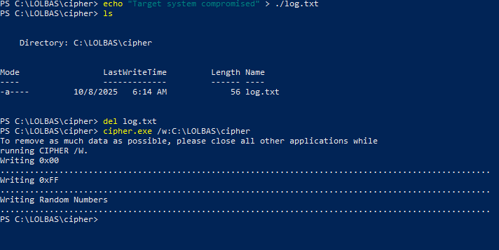

Cipher.exe 是 Windows 內建的加密工具，  
他的\*\*/w參數\*\*可徹底覆寫已刪除檔案的磁碟空間，  
讓鑑識人員無法還原任何痕跡

## Cipher.exe 介紹

* * *

cipher.exe 是 Windows 內建的工具，  
主要是用來管理 NTFS 上用 EFS 加密的檔案跟資料夾  
功能有這些：

*   加密/解密檔案資料夾
*   顯示檔案的加密狀態
*   備份與還原 EFS 加密憑證
*   徹底覆寫並清除磁碟區上已刪除檔案所占用的未使用空間

上面提到覆寫的功能，其實就是我們這篇的主要重點，  
一般來說刪檔案的時候，  
Windows 其實只是在檔案系統上的索引把它標記成已刪除，  
然後釋放他佔用的空間，

但原始的 binary file 還是會保留在磁碟上，  
直到新的資料來覆寫他，  
所以我們就可以透過覆寫全部未佔用空間來完成反鑑識的清理

## 工具特性

* * *

*   **路徑**: `C:\Windows\System32\cipher.exe`
*   **濫用點**: /w參數三階段覆寫（0x000xFF隨機）
*   **優勢**: 符合DoD 5220.22-M標準完全無法還原

## 核心攻擊Demo

* * *

攻擊的核心在於 cipher.exe 的 /w 參數

```
cipher.exe /w:<directory_path>

```

*   /w (Wipe)：這個參數會執行一個三階段的覆寫流程，來清除指定路徑所在磁碟區的所有未使用的空間：
    *   第一階段：寫入 0x00 (零)
    *   第二階段：寫入 0xFF (一)
    *   第三階段：寫入隨機數字

這個流程符合美國國防部 DoD 5220.22-M 資料銷毀標準，經過這三輪覆寫後，原始資料基本上不可能再透過軟體或硬體方式還原

### Demo: 抹除已刪除的惡意工具

#### Step 1: 模擬一個殘留的惡意檔案

```
# 建立一個模擬的日誌檔
echo "Target system compromised" > C:\LOLBAS\cipher\log.txt

# 刪除這個檔案
del C:\LOLBAS\cipher\log.txt

```

#### Step 2: 開始反鑑識清理

```
# /w: 指定執行清理功能
# C:\LOLBAS\cipher\ : 指定一個目標路徑cipher 會清理這個路徑所在的整個磁碟區未使用空間
cipher.exe /w:C:\LOLBAS\cipher\

```

過程裡面打開 task manager 應該就會看到 磁碟I/O 變超級高，  
而且會花一段時間才完成，  
這段時間 cipher 就是去把所以未佔用空間都覆寫過一輪了



## 防禦措施

* * *

```powershell
# 限制cipher執行
icacls C:\Windows\System32\cipher.exe /deny Everyone:(RX)

# 啟用命令稽核
auditpol /set /subcategory:"Process Creation" /success:enable

```

## IOCs

* * *

*   cipher.exe執行時間超過30秒
*   命令包含`/w:`參數
*   磁碟I/O突然100%
*   可用空間暫時降為0

## 總結

* * *

Cipher /w 提供了軍規級的資料銷毀，是攻擊者清理痕跡的終極工具  
三階段覆寫後，任何鑑識工具都無法還原

今天的文章主要面向不是做攻擊的部分，  
但清理也是很重要的一環，  
希望可以這篇文章帶給大家幫助，  
就這樣，明天見！