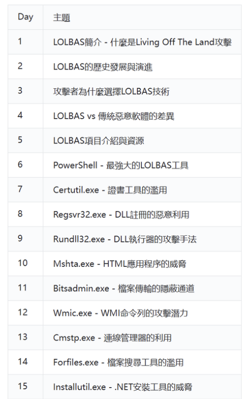
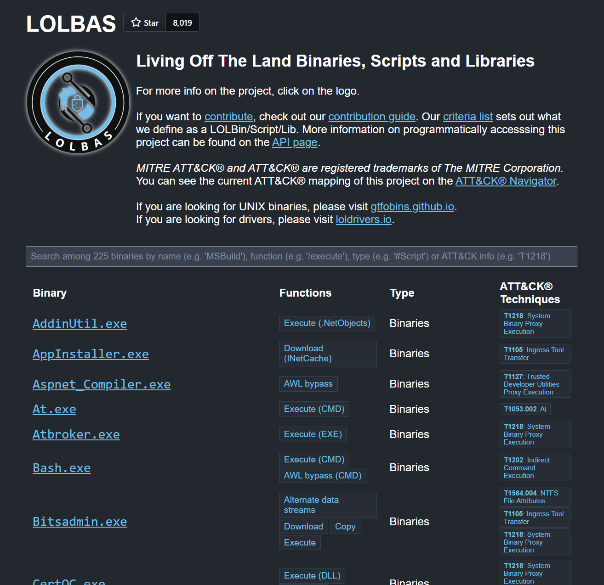
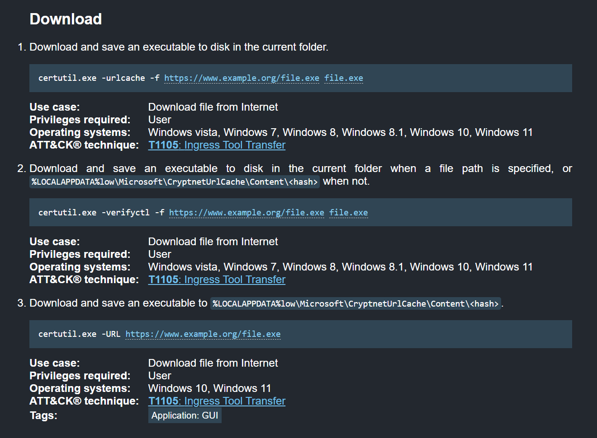

給每個正在看這篇文章的讀者，  
你好，我是貓頭鷹owl\_d，  
很開心這個系列來到了一個終點，

過程中也很感謝大家的支持與分享，  
如果這個系列有多多少少為你帶來了一些幫助，  
那我也會感到非常榮幸

在撰寫系列文章中，大部分篇幅應該都是專注在技術層面上，  
今天的這篇想做點不一樣的，  
就來帶正在閱讀的你一起看看寫作研究的過程是什麼樣子吧！

## 決定主題

* * *

### 大主題

就先從大主題 LOLBAS 開始好了，  
當初會選這個題目，也只是因為自己  
曾經在戰隊讀書會 B33F Hacking 發表過 Certuil.exe 跟 tpmtool 的漏洞而已，

那時候就有一位朋友（特別感謝我們的 hicat0x0 大佬w）說：  
欸還是你以後每次發表都講一個工具，感覺不錯  
好那我鐵人賽寫寫看XD

這個主題就這麼誕生了

### 小主題

其實一開始我的大綱是長這樣，  

跟現在的應該差蠻多的 XD  
在剛開賽那幾天剛好在準備面試的時候有想說，  
還是我前幾天就乾脆用 AI 查 LOLBAS 的歷史語法把資料整理一下水好幾篇，

不過在用了 XXX 牌 LLM 後發現，  
指令實際跑起來噴了一大堆 error，  
而且大家好像都在第二天後就正式開始切入重點了，

所以從第二天開始也就定案，  
我希望這一系列的文章，  
可以主要拆分成好幾個獨立的攻擊工具跟技術

不用把所有篇章看完才能理解，  
而是可以做為一個可以隨時翻閱的萬能工具箱

## 資料蒐集

* * *

研究的一開始我通常都是到 LOLBAS Project 裡面去翻工具  
[https://lolbas-project.github.io](https://lolbas-project.github.io)  

其實每項工具點進去都會有其他人已經發現的攻擊利用手法，  

再來也會有其他人的 blog，  
可以去看作者更細節的思路跟做法，  

資料蒐集得差不多就可以開始研究了！

## 研究

* * *

然後開始無止盡的

*   跟 procmon 奮戰
*   filter 用到眼睛流眼淚 XD
*   嘗試各種排列組合看誰可以叫出 cmd 或 calc
*   用心祈禱 defender 不會把整個腳本砍掉
*   攻擊完成後開始修環境跟不斷 snapshot
*   到現在 VM 的 explorer 都還是壞的（想找時間修修看，不想直接 snapshot 回去）
*   腳本DLL debug 的話我用的是 Claude

然後 2-4 個小時就消失了  
一篇文章也就成功這樣誕生了

## 小驚喜&特別感謝

* * *

其實一開始覺得自己的系列文章或許就是隨手寫寫就好，  
應該也不會有什麼人來讀，  
但也在某一天非常感謝馬老師還有相關社群朋友們幫忙轉發文章，

這大概是包括自己經營部落格以來，  
第一次覺得有人會來看了（?  
後面的文章也有試著去更用心完成

也在這邊再致謝一次，  
非常感謝

## 未來

* * *

之後會繼續研究 Windows 的洞，  
近期應該也會開始去準備 CRTP 了，  
另外自己本身也是個 pwner，

如果之後有什麼有趣的發現，  
應該也會再放到自己的個人部落格上，  
或是明年再來參加一次 XD

總之，可以期待看看w  
也歡迎大家來一起交流

## 總結

* * *

身為一個重度拖延症患者，  
參賽前大概也沒想過自己可以每天花時間投入研究，  
然後產出一篇文章，

有收到支持的瞬間也讓我感覺像場夢一樣，  
但這場 30 天的夢也準備要收尾了！  
總之，在最後的這篇文章也希望，

在每個閱讀的你，  
希望這系列的文章能夠多少帶來一些幫助，  
並且看到未來的更多可能性，

那，  
就讓我們一起開啟下一段的旅途吧！

.  
2025.10.14  
貓頭鷹 owl\_d